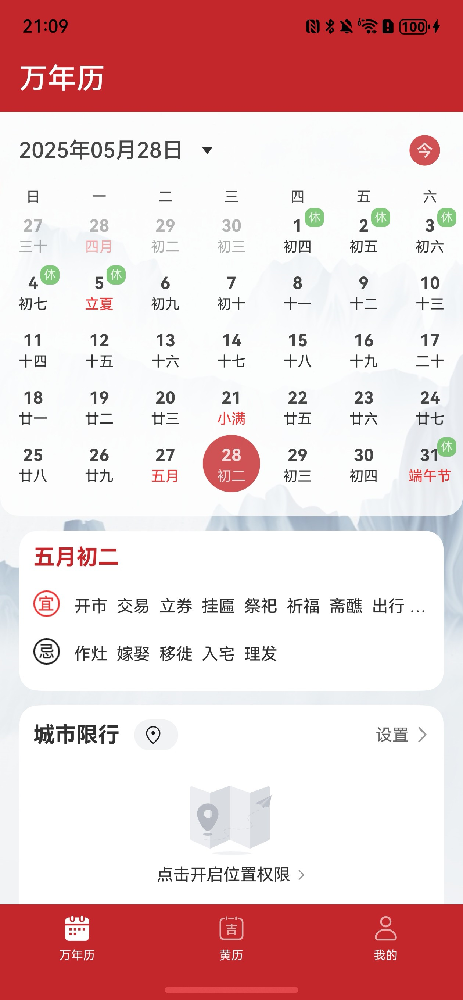
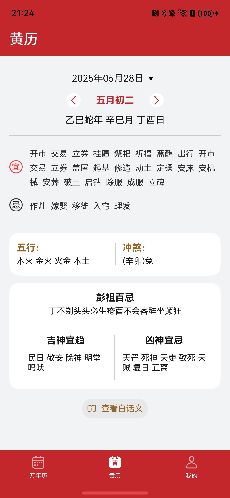
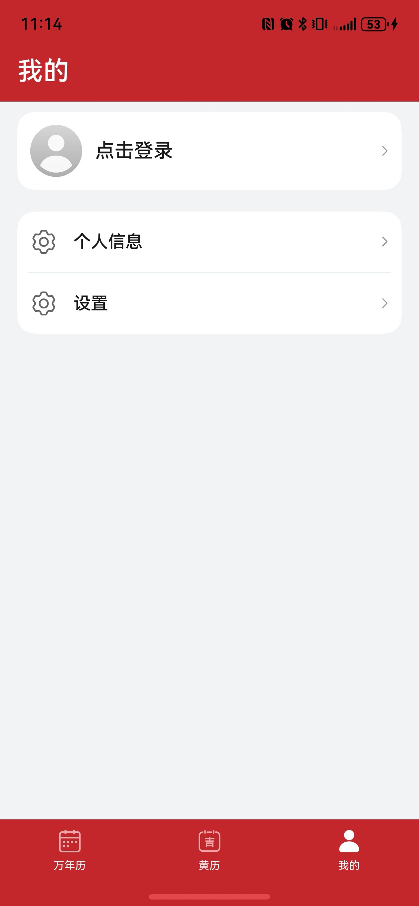
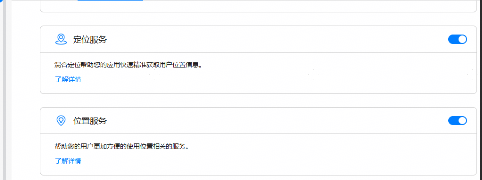

# 生活服务（日历）应用模板快速入门

## [ :fa-chain-broken: 源码下载](https://agc-storage-drcn.platform.dbankcloud.cn/v0/scenic-i0v1l/Calendar.zip?token=4fa42a5b-6547-493b-9ab9-c5dd1ef8c6a6)

## 目录

- [目录](#目录)
- [功能介绍](#功能介绍)
  - [模板](#模板)
- [注意事项](#注意事项)
- [组件](#组件)
- [环境要求](#环境要求)
  - [软件](#软件)
  - [硬件](#硬件)
- [快速入门](#快速入门)
  - [配置工程](#配置工程)
  - [运行调试工程](#运行调试工程)
- [示例效果](#示例效果)
- [权限要求](#权限要求)
- [开源许可协议](#开源许可协议)

## 功能介绍

您可以基于此[模板](#模板)直接定制应用/元服务，也可以挑选此模板中提供的多种[组件](#组件)使用，从而降低您的开发难度，提高您的开发效率。

### 模板
本模板为日历应用提供了常用功能的开发样例，模板主要分为万年历、黄历、和我的三大模块：

* 万年历：主要提供日历服务查询、吉日工具查询、日期查询、节日节气查询等功能。

* 黄历：根据选择日历展示黄历内容，支持切换日期查看今日宜以及今日忌。

* 我的：展示个人信息、华为账号一键登录、切换主题等。

| 万年历                                                   | 黄历                                                      | 我的                           
|-------------------------------------------------------|---------------------------------------------------------|------------------------------ 
|  |  |   

本模板主要页面及核心功能如下所示：

```ts
日历模板
 |-- 万年历
 |    |-- 日历选择
 |    |-- 吉日查询
 |    |-- 日期计算
 |    |-- 节日节气
 |    └-- 宜忌展示
 |-- 黄历
 |    |-- 日期切换
 |    |-- 宜忌展示
 |    |-- 五行、冲煞 
 |    |-- 彭祖百忌
 └-- 我的
 |     |-- 个人信息
 |     └-- 设置
 |       └-- 主题切换
 |       └-- 隐私协议
 |       └-- 用户协议  
```

本模板工程代码结构如下所示：

```ts
Application
├──├──commons
│   ├──common                                // 公共能力层
│     ├──src/main/ets                        // 基础能力
│     │  └──components                       // 公共组件
│     │  └──dividerTmp                       // 下划线公共组件
│     │  └──https                            // 网络请求库
│     │  └──models                           // 公共接口常量
│     │  └──quickLogin                       // 华为账号一键登录
│     │  └──style                            // 公共样式
│     │  └──utils                            // 工具类
│     │  └──viewmodels                       // 接口层
│     └──Index.ets                           // 对外接口类
│  ├──router_module                          // 全局路由组件
├──├──components                             // 公共组件
│   ├──base_apis                             // 通用组件（模态框，弹窗，选择器等）
│   ├──base_calendar                         // 日历组件
│   ├──calendar_almanac                      // 黄历组件
│   ├──calendar_events                       // 重要提醒组件
│   ├──date_calculation                      // 日期计算组件
│   ├──festival_solar                        // 节日节气组件
│   ├──login_info                            // 登录组件组件
│   ├──vip_center                            // 开通会员组件
│   ├──traffic_restriction                   // 城市限行组件
│   ├──yiji_query                            // 宜忌查询组件
├──features                                  // 基础特性层
│  ├──almanac/src/main/ets                   // 黄历
│  │  ├──pages                               // 首页入口
│     │  ├──AlmanacView                      // 黄历入口
│  ├──almanac/src/main/resources             // 资源文件目录
│  ├──almanac/Index.ets                      // 对外接口类
│  ├──perpetual/src/main/ets                 // 万年历
│  │  ├──components                          // 万年历组件
│  │  ├──pages                               
│     │  ├──PerpetualCalendar                // 万年历组件入口
│  ├──perpetual/src/main/resources           // 资源文件目录
│  ├──perpetual/Index.ets                    // 对外接口类
│  ├──mine/src/main/ets                      // 我的（包含一键登录）
│  │  └──pages                               // 我的入口页
│     │  ├──MinePage                         // 登录
│  │  └──components                          // 我的页面入口
│  └──mine/src/main/resources                // 资源文件目录
└─product/entry/src/main   
   ├─ets
   │  ├─widget
   │  │  ├──pages            
   │  │      ├──WidgetCard.ets       // 服务卡片    
   │  ├─entryability
   │  │      ├──EntryAbility.ets             // 应用程序入口
   │  ├─page
   │  │  ├──Index.ets                        // 入口
   │  │  ├──PrivacyPage.ets                  // 隐私协议   
   │  │  ├──SafePage.ets                     // 隐私协议弹窗  
   │  │  ├──SplashPage.ets                   // 闪屏页        
   │  │  ├──TabContainer.ets                 // tab页入口
   └─resources
```

## 注意事项

* 本模版提供的均是模拟数据，所有服务跳转到的页面均为本地mock页面或者lunar三方库提供的数据，实际开发中请以具体业务为准。
* 本模版登录中获取验证码场景为模拟场景，真实场景以业务实际场景为准。
* 本模版在未配置华为账号一键登录的情况下为保证正常使用本模版，均采用模拟用户信息登录，实际开发中请以具体业务为准。

## 组件

本模板中提供了多种组件，您可以按需选择合适的组件进行使用，所有组件存放在工程根目录的components下。

| 组件                         | 描述                                          | 使用指导                                            |
|----------------------------|---------------------------------------------| --------------------------------------------------- |
| 基础能力组件                     | 包括模态框，对话框，选择器，公共方法等                         | [使用指导](components/base_apis/README.md)|
| 日历组件（BaseCalendar）         | 展示当前日期日历、自定义头部项插槽、节日、节气展示颜色等相关的能力           | [使用指导](components/base_calendar/README.md)      |
| 黄历组件（CalendarAlmanac）      | 日历黄历组件，支持日期动态选择，阴历阳历，五行等信息展示                | [使用指导](components/calendar_almanac/README.md)      |
| 日程提醒（CalendarEventMain）    | 日历重要提醒，支持新增以及编辑日历，生日，纪念日，待办。支持日程添加到系统日历提醒中  | [使用指导](components/calendar_events/README.md)|
| 日期计算（DateToolsCalculate）   | 本组件日期计算的相关能力，包括日期间隔，日期计算，阴阳转换等功能            | [使用指导](components/date_calculation/README.md)|
| 节日节气（FestivalSolar）        | 本组件提供了节日节气展示的相关功能                           | [使用指导](components/festival_solar/README.md)|
| 登录（LoginInfo）              | 本组件提供了用户信息展示，登录，个人信息编辑，华为账号一键登录，开通会员入口的相关功能 | [使用指导](components/login_info/README.md)|
| 会员中心（VipCenter）            | 本组件提供了用户会员开通功能                              | [使用指导](components/vip_center/README.md)|
| 宜忌查询组件（YiJiQuery）          | 查询开始日期到结束日期内的吉日以及忌日的相关功能                    | [使用指导](components/yiji_query/README.md)         |
| 城市限行组件（TrafficRestriction） | 查询定位城市限行信息                                  | [使用指导](components/traffic_restriction/README.md)         |


## 环境要求

### 软件

* DevEco Studio版本：DevEco Studio 5.0.4 Release及以上
* HarmonyOS SDK版本：HarmonyOS 5.0.4 Release SDK及以上

### 硬件

* 设备类型：华为手机（直板机）
* HarmonyOS版本：HarmonyOS 5.0.4 Release及以上

## 快速入门

### 配置工程

在运行此模板前，需要完成以下配置：

1. 在DevEco Studio中打开此模板。

2. 在AppGallery Connect创建应用，将包名配置到模板中。

   a. 参考[创建HarmonyOS应用](https://developer.huawei.com/consumer/cn/doc/app/agc-help-createharmonyapp-0000001945392297)为应用创建APPID，并进行关联。

   b. 返回应用列表页面，查看应用的包名。

   c. 将Application/AppScope/app.json5文件中的bundleName替换为创建应用的包名。

3. 依次在“API管理”处开通位置服务、定位服务。

     

4. 配置华为账号服务。

   a. 将应用的client ID配置到Application/product/entry模块的module.json5文件，详细参考：[配置Client ID](https://developer.huawei.com/consumer/cn/doc/harmonyos-guides/account-client-id)。


b. 添加公钥指纹，详细参考：[配置应用证书指纹](https://developer.huawei.com/consumer/cn/doc/app/agc-help-signature-info-0000001628566748#section5181019153511)。

c. 配置scope权限：[配置scope权限](https://developer.huawei.com/consumer/cn/doc/harmonyos-guides/account-config-permissions)。

### 运行调试工程

1. 连接调试手机和PC。

2. 对应用[手工签名](https://developer.huawei.com/consumer/cn/doc/harmonyos-guides/ide-signing#section297715173233)。

3. 菜单选择“Run > Run 'entry' ”或者“Run > Debug 'entry' ”，运行或调试模板工程。

## 示例效果

1. 万年历

   

2. 黄历

   

3. 我的

   


## 权限要求

* 网络权限：ohos.permission.INTERNET

## 开源许可协议

该代码经过[Apache 2.0 授权许可](http://www.apache.org/licenses/LICENSE-2.0)。
