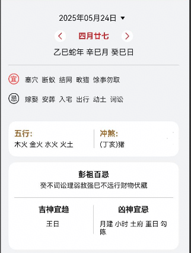
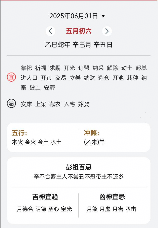

# 黄历组件快速入门

## 目录

- [简介](#简介)
- [约束与限制](#约束与限制)
- [快速入门](#快速入门)
- [API参考](#API参考)
- [示例代码](#示例代码)

## 简介

黄历组件支持日期动态选择，阴历阳历、五行等信息展示。



## 约束与限制

### 软件

* DevEco Studio版本：DevEco Studio 5.0.4 Release及以上
* HarmonyOS SDK版本：HarmonyOS 5.0.4 Release及以上

### 硬件

* 设备类型：华为手机（直板机）
* HarmonyOS版本：HarmonyOS 5.0.4 Release及以上


## 快速入门

1. 安装组件。

   如果是在DevEvo Studio使用插件集成组件，则无需安装组件，请忽略此步骤。

   如果是从生态市场下载组件，请参考以下步骤安装组件。

   a. 解压下载的组件包，将包中所有文件夹拷贝至您工程根目录的XXX目录下。

   b. 在项目根目录build-profile.json5添加calendar_almanac和base_apis模块。
    ```typescript
    // 在项目根目录build-profile.json5填写calendar_almanac和base_apis路径。其中XXX为组件存放的目录名
    "modules": [
        {
        "name": "calendar_almanac",
        "srcPath": "./XXX/calendar_almanac",
        },
        {
        "name": "base_apis",
        "srcPath": "./XXX/base_apis",
        }
    ]
    ```
   c. 在项目根目录oh-package.json5中添加依赖。
    ```typescript
    // XXX为组件存放的目录名称
    "dependencies": {
      "calendar_almanac": "file:./XXX/calendar_almanac"
    }
   ```

2. 引入组件。

   ```typescript
    import { CalendarAlmanac } from 'calendar_almanac';
   ```

3. 调用组件，详细参数配置说明参见[API参考](#API参考)。

   ```typescript
   // 引入组件
   import { CalendarAlmanac } from 'calendar_almanac';
   
   @Entry
   @Component
   struct Index {
     build() {
       Column() {
         CalendarAlmanac({
           selectDate: new Date('2025-06-01'),
           arrowColor: 'standard',
           selectTextColor: '#c4272b',
           onDateChange: (date: Date) => {
             console.log('日期切换，当前的日期是' + date);
           },
         });
       }
     }
   }
   ```

## API参考

### 子组件

无

### 接口

CalendarAlmanac(options?: CalendarAlmanacOptions)

日历黄历组件，支持日期动态选择，阴历阳历、五行等信息展示。

**参数：**

| 参数名  | 类型                                                      | 必填 | 说明             |
| ------- | --------------------------------------------------------- | ---- | ---------------- |
| options | [CalendarAlmanacOptions](#CalendarAlmanacOptions对象说明) | 否   | 黄历组件的参数。 |

### CalendarAlmanacOptions对象说明

| 名称        | 类型                                                                                                    | 必填 | 说明                           |
| ----------- |-------------------------------------------------------------------------------------------------------| ---- |------------------------------|
| selectDate  | string                                                                                                | 否   | 传入当前日期，默认当日日期 时间格式YYYY-MM-DD |
| selectTextColor | [ResourceStr](https://developer.huawei.com/consumer/cn/doc/harmonyos-references/ts-types#resourcestr) | 否   | 文本按钮颜色，默认颜色#c4272b           |
| arrowColor     | 'standard'\|'blue' \|'red'                                                                               | 否   | 左右切换箭头颜色，默认主题颜色standard         |

### 事件

支持以下事件：

#### onDateChange

onDateChange(callback: date:Date)) => void)

日期变化事件，返回当前日期

## 示例代码

### 示例1（修改传入日期）

本示例通过selectDate实现不同日期的切换。
   ```typescript
   // 引入组件
   import { CalendarAlmanac } from 'calendar_almanac';
   
   @Entry
   @Component
   struct Index {
     build() {
       Column() {
         CalendarAlmanac({
            selectDate: new Date('2025-06-01'),
            arrowColor: "blue",
            selectTextColor: "#c4272b",
         });
       }
     }
   }
   ```
