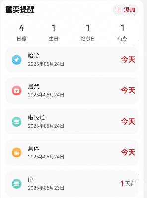
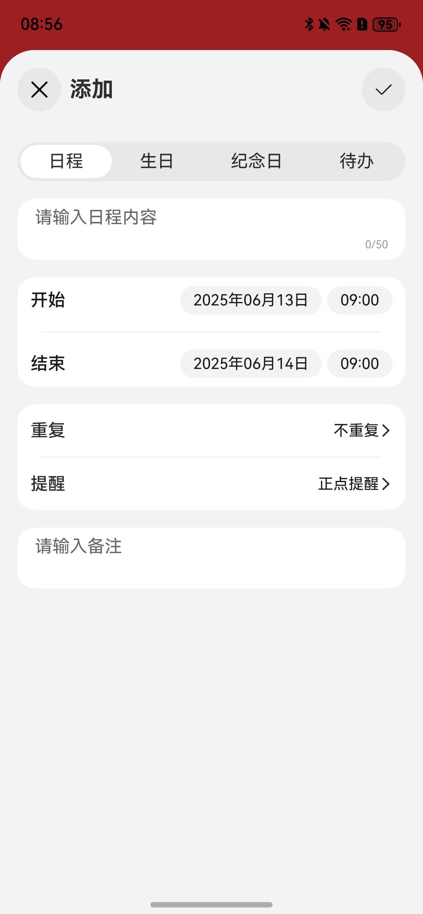

# 日程提醒组件快速入门

## 目录

- [简介](#简介)
- [约束与限制](#约束与限制)
- [快速入门](#快速入门)
- [API参考](#API参考)
- [示例代码](#示例代码)

## 简介

日历重要提醒支持新增以及编辑日历、生日、纪念日、待办，支持将日程添加到系统日历提醒中。



## 约束与限制
### 软件

* DevEco Studio版本：DevEco Studio 5.0.4 Release及以上
* HarmonyOS SDK版本：HarmonyOS 5.0.4 Release及以上

### 硬件

* 设备类型：华为手机（直板机）
* HarmonyOS版本：HarmonyOS 5.0.4 Release及以上

### 权限
* 获取位置权限：ohos.permission.WRITE_CALENDAR，ohos.permission.READ_CALENDAR。
* 网络权限：ohos.permission.INTERNET

## 快速入门

1. 安装组件。

   如果是在DevEvo Studio使用插件集成组件，则无需安装组件，请忽略此步骤。

   如果是从生态市场下载组件，请参考以下步骤安装组件。

   a. 解压下载的组件包，将包中所有文件夹拷贝至您工程根目录的XXX目录下。

   b. 在项目根目录build-profile.json5添加calendar_events和base_apis模块。

    ```typescript
    // 在项目根目录build-profile.json5填写base_calendar和base_apis路径。其中XXX为组件存放的目录名
    "modules": [
        {
        "name": "calendar_events",
        "srcPath": "./XXX/calendar_events",
        },
        {
        "name": "base_apis",
        "srcPath": "./XXX/base_apis",
        }
    ]
    ```
   c. 在项目根目录oh-package.json5中添加依赖。
    ```typescript
    // XXX为组件存放的目录名称
    "dependencies": {
      "calendar_events": "file:./XXX/calendar_events"
    }
   ```

2. 引入组件。

   ```typescript
    import { CalendarEventMain } from 'calendar_events';
   ```

3. 调用组件，详细参数配置说明参见[API参考](#API参考)。

      ```typescript
   // 引入组件
   import { CalendarEventMain,UserEventItem } from 'calendar_events';

   
   @Entry
   @Component
   struct Index {
     pageInfo:NavPathStack = new NavPathStack() 
     build() {
       Navigation(this.pageInfo) {
         CalendarEventMain({
           pathStack: this.pageInfo,
           onCalendarEventChange: (userEventInfo: UserEventItem) => {
             console.log('change userEventInfo', JSON.stringify(userEventInfo));
           },
           onCalendarEventDelete: (userEventInfo: UserEventItem) => {
             console.log('delete userEventInfo', JSON.stringify(userEventInfo));
           },
         });
       }
       .hideTitleBar(true)
     }
   }
   ```

## API参考

### 子组件

无

### 接口

CalendarEventMain(options?: CalendarEventMainOptions)

日历重要提醒，支持新增以及编辑日历、生日、纪念日、待办，支持将日程添加到系统日历提醒中。

**参数：**

| 参数名  | 类型                                                         | 必填 | 说明       |
| ------- | ------------------------------------------------------------ | ---- |----------|
| options | [CalendarEventMainOptions](#CalendarEventMainOptions对象说明) | 否   | 提醒组件的参数。 |

### CalendarEventMainOptions对象说明

| 名称      | 类型                                                         | 必填 | 说明                   |
| --------- | ------------------------------------------------------------ | ---- | ---------------------- |
| pathStack | [NavPathStack](https://developer.huawei.com/consumer/cn/doc/harmonyos-references/ts-basic-components-navigation#navpathstack10) | 是   | 传入当前组件所在路由栈 |

### UserEventItem对象说明

| 名称       | 类型                                            | 必填 | 说明            |
| ---------- | ----------------------------------------------- |----|---------------|
| id         | string                                          | 是  | 日程提醒ID        |
| eventType  | [EVENT_TYPE](#EVENT_TYPE对象说明)               | 是  | 日程提醒类型        |
| eventId    | number                                          | 是  | 添加到日历之后生成的ID  |
| content    | string                                          | 是  | 日程提醒内容        |
| date       | [CalendarStartDate](#CalendarStartDate对象说明) | 是  | 开始日期时间、结束日期时间 |
| repeatType | string                                          | 是  | 提醒类型          |
| remindList | [REMIND_MENU](#REMIND_MENU对象说明)             | 是  | 重复类型          |
| remarks    | string                                          | 否  | 备注            |
| isDone     | boolean                                         | 否  | 是否完成          |

### CalendarStartDate对象说明

| 名称 | 类型   | 必填 | 说明 |
| ---- | ------ | ---- | ---- |
| date | Date   | 是   | 日期 |
| time | string | 是   | 时间 |

### EVENT_TYPE对象说明

| 名称          | 类型          | 必填 | 说明  |
| ------------- | ------------- | ---- |-----|
| SCHEDULE      | schedule      | 是   | 日程  |
| BIRTHDAY      | birthday      | 是   | 生日  |
| ANNIVERSARIES | anniversaries | 是   | 纪念日 |
| TODO          | todo          | 是   | 待办  |

### REMIND_MENU对象说明

| 名称      | 类型       | 必填 |
| --------- | ---------- | ---- |
| NO_REPEAT | 不重复     | 是   |
| DAILY     | 每天       | 是   |
| WEEKLY    | 每周       | 是   |
| MONTHLY   | 每月       | 是   |
| YEARLY    | 每年       | 是   |
| HOLIDAY   | 法定工作日 | 是   |

### 事件

支持以下事件：

#### onCalendarEventChange

onCalendarEventChange(callback: userEventInfo:[UserEventItem](#UserEventItem对象说明))) => void)

日程提醒添加更新回调，返回添加或者更新的日程信息

#### onCalendarEventDelete

onCalendarEventDelete(callback: userEventInfo:[UserEventItem](#UserEventItem对象说明))) => void)

日程提醒删除回调，返回当前删除的日程信息

## 示例代码

### 示例1（修改传入日期）

本示例通过onCalendarEventChange回调获取添加的日程信息。
   ```typescript
import { CalendarEventMain, UserEventItem } from 'calendar_events';

@Entry
@Component
struct Index {
   pageInfo: NavPathStack = new NavPathStack()

   build() {
      Navigation(this.pageInfo) {
         CalendarEventMain({
            pathStack: this.pageInfo,
            onCalendarEventChange: (userEventInfo: UserEventItem) => {
               console.log('change userEventInfo', JSON.stringify(userEventInfo));
            },
         })
      }
      .hideTitleBar(true)
   }
}
   ```

