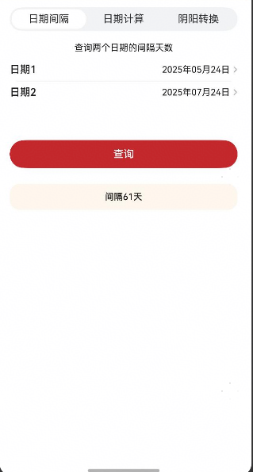
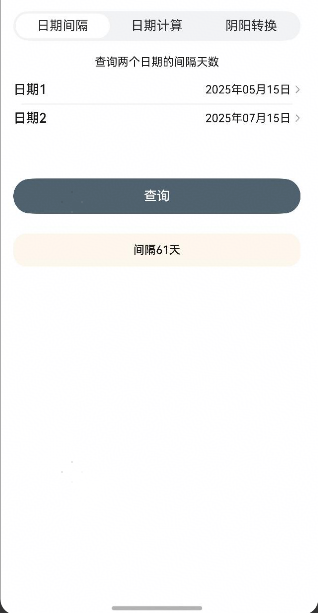

# 日历计算组件快速入门

## 目录

- [简介](#简介)
- [约束与限制](#约束与限制)
- [快速入门](#快速入门)
- [API参考](#API参考)
- [示例代码](#示例代码)

## 简介

本组件提供了日期计算的相关能力，包括日期间隔、日期计算、阳历转阴历等功能。



## 约束与限制
### 软件

* DevEco Studio版本：DevEco Studio 5.0.4 Release及以上
* HarmonyOS SDK版本：HarmonyOS 5.0.4 Release及以上

### 硬件

* 设备类型：华为手机（直板机）
* HarmonyOS版本：HarmonyOS 5.0.4 Release及以上


## 快速入门

1. 安装组件。

   如果是在DevEvo Studio使用插件集成组件，则无需安装组件，请忽略此步骤。

   如果是从生态市场下载组件，请参考以下步骤安装组件。

   a. 解压下载的组件包，将包中所有文件夹拷贝至您工程根目录的XXX目录下。

   b. 在项目根目录build-profile.json5添加date_calculation和base_apis模块。

    ```typescript
    // 在项目根目录build-profile.json5填写date_calculation和base_apis路径。其中XXX为组件存放的目录名
    "modules": [
        {
        "name": "date_calculation",
        "srcPath": "./XXX/date_calculation",
        },
        {
        "name": "base_apis",
        "srcPath": "./XXX/base_apis",
        }
    ]
    ```

    c. 在项目根目录oh-package.json5中添加依赖。
    ```typescript
    // XXX为组件存放的目录名称
    "dependencies": {
      "date_calculation": "file:./XXX/date_calculation"
    }
   ```

2. 引入组件。

   ```typescript
   import { DateToolsCalculate } from 'date_calculation';
   ```

3. 调用组件，详细参数配置说明参见[API参考](#API参考)。

      ```typescript
   import { DateToolsCalculate } from 'date_calculation';
   
   @Entry
   @Component
   struct Index {
     build() {
       Column() {
         DateToolsCalculate({
           startDate: new Date('2025-5-28'),
           buttonColor: '#c4272b',
           textColor: '#ffffff',
         })
       }
     }
   }
   ```

## API参考

### 子组件

无

### 接口

DateToolsCalculate(options?: DateToolsCalculateOptions)

日期计算的相关能力，包括日期间隔、日期计算、阳历转阴历等功能。

**参数：**

| 参数名  | 类型                                                         | 必填 | 说明               |
| ------- | ------------------------------------------------------------ | ---- | ------------------ |
| options | [DateToolsCalculateOptions](#DateCalculationOptions对象说明) | 否   | 日期计算功能组件。 |

### DateToolsCalculateOptions对象说明

| 名称        | 类型                                                         | 必填 | 说明     |
| ----------- | ------------------------------------------------------------ | ---- | -------- |
| buttonColor | [ResourceStr](https://developer.huawei.com/consumer/cn/doc/harmonyos-references/ts-types#resourcestr) | 否   | 按钮颜色 |
| textColor   | [ResourceStr](https://developer.huawei.com/consumer/cn/doc/harmonyos-references/ts-types#resourcestr) | 否   | 文字颜色 |
| startDate   | [ResourceStr](https://developer.huawei.com/consumer/cn/doc/harmonyos-references/ts-types#resourcestr)\| number | 否   | 开始日期 |

### 事件

支持以下事件：

#### onIntervalSearch

onSearch(callback: betweenDates: number)) => void)

日期间隔查询事件，返回日期间隔

#### onCalculateSearch

onSearch(callback: calculateInfo: [LuckyDays](#LuckyDays对象说明))) => void)

日期计算查询事件，返回查询日期计算详情

#### onConvertSearch

onSearch(callback: lunarDateInfo:  [LunarInfo](#LunarInfo对象说明))) => void)

阳历转阴历查询事件，返回转换的日期详情

**参数：**

| 参数名        | 类型                            | 必填 | 说明                         |
| ------------- | ------------------------------- | ---- | ---------------------------- |
| calculateInfo | [LuckyDays](#LuckyDays对象说明) | 是   | 根据时间条件查询到的日期信息 |

### LunarInfo对象说明

| 参数名        | 类型                                                         | 必填 | 说明                           |
| ------------- | ------------------------------------------------------------ | ---- | ------------------------------ |
| daysFromNow   | number                                                       | 是   | 查询到的日期距离今天还有多少天 |
| solarDate     | Date \| string                                               | 是   | 阴历日期                       |
| lunarDate     | string                                                       | 是   | 农历日期                       |
| ganZhiYear    | string                                                       | 是   | 天干地支年                     |
| ganZhiMonth   | string                                                       | 是   | 天干地支月                     |
| ganZhiDay     | string                                                       | 是   | 天干地支日                     |
| weekday       | string                                                       | 是   | 周几                           |
| forwardOrBack | [CALCULATION_TYPE](#CALCULATION_TYPE对象说明) | 否   | 查询日期往后还是往前           |

### CALCULATION_TYPE对象说明

| 参数名   | 类型   | 必填 | 说明 |
| -------- | ------ | ---- | ---- |
| FORWARD  | string | 是   | 向前 |
| BACKWARD | string | 是   | 向后 |

### LunarInfo对象说明

| 名称    | 类型   | 必填 | 说明 |
| ------- | ------ | ---- | ---- |
| year    | string | 是   | 年   |
| month   | string | 是   | 月   |
| day     | string | 是   | 日   |
| weekday | string | 是   | 星期 |

### LuckyDays对象说明

| 名称    | 类型   | 必填 | 说明      |
| ------- | ------ | ---- |---------|
| daysFromNow    | string | 是   | 距离今天的天数 |
| solarDate   | string | 是   | 阳历日期    |
| lunarDate     | string | 是   | 农历日期    |
| ganZhiYear | string | 是   | 天干地支年   |
| ganZhiMonth | string | 是   | 天干地支月   |
| forwardOrBack | string | 是   | 向前向后查询  |
| ganZhiDay | string | 是   | 天干地支日   |
| weekday | string | 是   | 星期      |

## 示例代码

### 示例1（修改主题颜色）

本示例通过buttonColor实现按钮颜色切换

   ```typescript
   import { DateToolsCalculate } from 'date_calculation';
   
   @Entry
   @Component
   struct Index {
     build() {
       Column() {
         DateToolsCalculate({
            startDate: new Date('2025-5-28'),
            buttonColor: '#4F616D',
            textColor: '#ffffff',
         })
       }
     }
   }
   ```

