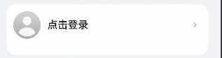

# LoginInfo组件快速入门

## 目录

- [简介](#简介)
- [约束与限制](#约束与限制)
- [快速入门](#快速入门)
- [API参考](#API参考)
- [示例代码](#示例代码)

## 简介

本组件提供了用户信息展示，登录，个人信息编辑，华为账号一键登录，开通会员入口的相关功能



## 约束与限制
### 软件

* DevEco Studio版本：DevEco Studio 5.0.4 Release及以上
* HarmonyOS SDK版本：HarmonyOS 5.0.4 Release及以上

### 硬件

* 设备类型：华为手机（直板机）
* HarmonyOS版本：HarmonyOS 5.0.4 Release及以上

## 快速入门

1. 安装组件。

   如果是在DevEvo Studio使用插件集成组件，则无需安装组件，请忽略此步骤。

   如果是从生态市场下载组件，请参考以下步骤安装组件。

   a. 解压下载的组件包，将包中所有文件夹拷贝至您工程根目录的XXX目录下。

   b. 在项目根目录build-profile.json5添加login_info和base_apis模块。

   ```typescript
    // 在项目根目录build-profile.json5填写login_info和base_apis路径。其中XXX为组件存放的目录名
    "modules": [
        {
        "name": "base_calendar",
        "srcPath": "./XXX/login_info",
        },
        {
        "name": "base_apis",
        "srcPath": "./XXX/base_apis",
        }
    ]
    ```
   c. 在项目根目录oh-package.json5中添加依赖。
    ```typescript
    // XXX为组件存放的目录名称
    "dependencies": {
      "login_info": "file:./XXX/login_info"
    }
   ```
   
2. 引入组件。

   ```typescript
     import { LoginInfo} from 'login_info';
   ```

3. 调用组件，详细参数配置说明参见[API参考](#API参考)

   ```typescript
   import { LoginInfo, LoginParams, UserInfo } from 'login_info';
   
   @Entry
   @Component
   struct Index {
     pageInfo: NavPathStack = new NavPathStack()
   
     build() {
       Navigation(this.pageInfo) {
         LoginInfo({
           userInfo: new UserInfo({
             'avatar': '',
             'userName': '张三',
             'phoneNumber': '123xxx456',
           }),
           isLogin: true,
           routerModule: this.pageInfo,
           onLogin: (loginParams: LoginParams) => {
             console.log('onLogin', JSON.stringify(loginParams));
           },
           onHuaweiLogin: (loginParams: LoginParams) => {
             console.log('onHuaweiLogin', JSON.stringify(loginParams));
           },
           onVipClick: () => {
           },
         });
       }
     }
   }
   ```

## API参考

### 子组件

无

### 接口

LoginInfo(options?: LoginInfoOptions)

用户信息组件。

**参数：**

| 参数名      | 类型                                                                                                                                                                 | 必填 | 说明      |
|:---------|:-------------------------------------------------------------------------------------------------------------------------------------------------------------------|----|---------|
| options  | [LoginInfoOptions](#LoginInfoOptions对象说明)  | 否  | 用户信息组件。 |

### LoginInfoOptions对象说明

| 名称        | 类型                         | 必填 | 说明     |
|:----------|:---------------------------|----|--------|
| UserInfo  | [UserInfo](#UserInfo对象说明)  | 是  | 登录用户信息 |

### UserInfo对象说明

| 名称           | 类型      | 必填  | 说明     |
|:-------------|:--------|:----|:-------|
| avatar       | string  | 是   | 用户头像   |
| phoneNumber  | string  | 是   | 用户手机号  |
| userName     | string  | 是   | 用户名    |
| routerModule | [NavPathStack](https://developer.huawei.com/consumer/cn/doc/harmonyos-references/ts-basic-components-navigation#navpathstack10) | 是   | 传入当前组件所在路由栈 |
### 事件

支持以下事件：

#### onLogin

onLogin(callback: (loginParams:[LoginParams](#LoginParams对象说明)) => void)

登录点击事件，返回用户登录参数

#### onHuaweiLogin

onHuaweiLogin(callback: (loginParams:[LoginParams](#LoginParams对象说明)) => void)

华为账号一键登录点击事件，返回华为账号一键登录authorizationCode

#### onVipClick

onVipClick(callback: () => void)

登录信息栏点击事件

### LoginParams对象说明

| 名称                 | 类型      | 必填  | 说明                       |
|:-------------------|:--------|:----|:-------------------------|
| phoneNumber        | string  | 是   | 用户手机号                    |
| authorizationCode  | string  | 是   | 账号一键登录authorizationCode  |

## 示例代码

### 示例1

1. 调用组件，详细参数配置说明参见[API参考](#API参考)

   ```typescript
   import { LoginInfo, UserInfo,LoginParams } from 'login_info';
   
   @Entry
   @ComponentV2
   struct Index {
     pageInfo: NavPathStack = new NavPathStack()
     @Local userInfo:UserInfo = new UserInfo()
     @Local isLogin:boolean = false
     mockUserLogin() {
       this.isLogin = true;
       let mockUserInfo: UserInfo = new UserInfo({
         'idToken': '',
         'userName': '华为用户',
         'avatar': '',
         'phoneNumber': '123xxxxx789',
       })
       this.userInfo = mockUserInfo
       this.pageInfo.pop();
     }
     build() {
       Navigation(this.pageInfo) {
         LoginInfo({
           userInfo: this.userInfo,
           isLogin: this.isLogin,
           routerModule: this.pageInfo,
           onLogin: (loginParams: LoginParams) => {
             this.mockUserLogin()
             console.log('onLogin', JSON.stringify(loginParams))
           },
           onHuaweiLogin: (loginParams: LoginParams) => {
             this.mockUserLogin()
             console.log('onHuaweiLogin', JSON.stringify(loginParams))
           },
         })
       }
       .hideTitleBar(true)
     }
   }
   ```

