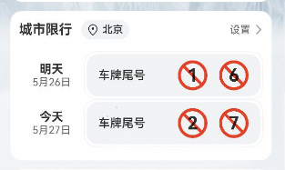
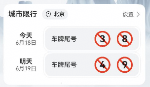

# 城市限行组件快速入门

## 目录

- [简介](#简介)
- [约束与限制](#约束与限制)
- [快速入门](#快速入门)
- [API参考](#API参考)
- [示例代码](#示例代码)


## 简介

本组件提供了城市限行组件，当前尾号限行数据均为mock数据，实际开发请填充业务真实数据



## 约束与限制
### 软件

* DevEco Studio版本：DevEco Studio 5.0.4 Release及以上
* HarmonyOS SDK版本：HarmonyOS 5.0.4 Release及以上

### 硬件

* 设备类型：华为手机（直板机）
* HarmonyOS版本：HarmonyOS 5.0.4 Release及以上

### 权限
* 获取位置权限：ohos.permission.APPROXIMATELY_LOCATION，ohos.permission.LOCATION。
* 网络权限：ohos.permission.INTERNET

## 快速入门

1. 安装组件。

   如果是在DevEvo Studio使用插件集成组件，则无需安装组件，请忽略此步骤。

   如果是从生态市场下载组件，请参考以下步骤安装组件。

   a. 解压下载的组件包，将包中所有文件夹拷贝至您工程根目录的XXX目录下。

   b. 在项目根目录build-profile.json5添加traffic_restriction模块。

    ```typescript
    // 在项目根目录build-profile.json5填写traffic_restriction路径。其中XXX为组件存放的目录名
    "modules": [
        {
        "name": "traffic_restriction",
        "srcPath": "./XXX/traffic_restriction",
        }
    ]
    ```
   c. 在项目根目录oh-package.json5中添加依赖。
    ```typescript
    // XXX为组件存放的目录名称
    "dependencies": {
      "traffic_restriction": "file:./XXX/traffic_restriction"
    }
   ```
2. 引入组件。

   ```typescript
     import { TrafficRestriction } from 'traffic_restriction';
   ```

3. 调用组件，详细参数配置说明参见[API参考](#API参考)

   ```typescript
   import { TrafficRestriction } from 'traffic_restriction';
   @Entry
   @Component
   struct Index {
    build() {
    	Column() {
      	   TrafficRestriction()
    	}
    }
   }		
   ```

## API参考

### 子组件

无

### 接口

TrafficRestriction(options?: TrafficRestrictionOptions)

城市限行组件。

**参数：**

| 参数名  | 类型                                                   | 必填 | 说明           |
| :------ | :----------------------------------------------------- | ---- | -------------- |
| options | [TrafficRestrictionOptions](#LoginInfoOptions对象说明) | 否   | 城市限行组件。 |

### TrafficRestrictionOptions对象说明

| 名称       | 类型 | 必填 | 说明     |
| :--------- | :--- | ---- | -------- |
| selectDate | Date | 否   | 当前日期 |

## 示例代码

### 示例1（

本示例通过selectDate实现不同日期的限行查询

```typescript
import { TrafficRestriction } from 'traffic_restriction';
@Entry
@Component
struct Index {
  build() {
    Column() {
      TrafficRestriction({
         selectDate:new Date('2025-6-18')
      })
    }
  }
}		
```



```

```