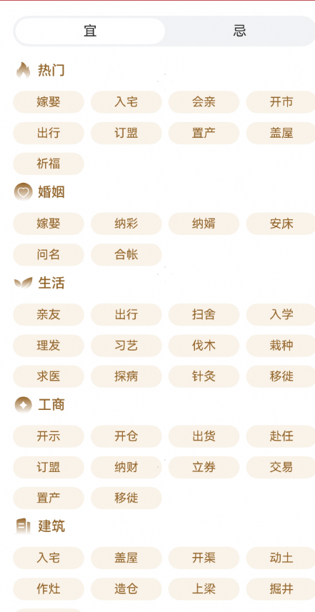

# 宜忌查询组件快速入门

## 目录

- [简介](#简介)
- [约束与限制](#约束与限制)
- [快速入门](#快速入门)
- [API参考](#API参考)
- [示例代码](#示例代码)

## 约束与限制
### 软件

* DevEco Studio版本：DevEco Studio 5.0.4 Release及以上
* HarmonyOS SDK版本：HarmonyOS 5.0.4 Release及以上

### 硬件

* 设备类型：华为手机（直板机）
* HarmonyOS版本：HarmonyOS 5.0.4 Release及以上

## 快速入门

本组件提供了查询开始日期到结束日期内的吉日以及忌日的相关功能。



## 使用

1. 安装组件。

   如果是在DevEvo Studio使用插件集成组件，则无需安装组件，请忽略此步骤。

   如果是从生态市场下载组件，请参考以下步骤安装组件。

   a. 解压下载的组件包，将包中所有文件夹拷贝至您工程根目录的XXX目录下。

   b. 在项目根目录build-profile.json5添加yiji_query和base_apis模块。

   ```typescript
    // 在项目根目录build-profile.json5填写yiji_query和base_apis路径。其中XXX为组件存放的目录名
    "modules": [
        {
        "name": "yiji_query",
        "srcPath": "./XXX/yiji_query",
        },
        {
        "name": "base_apis",
        "srcPath": "./XXX/base_apis",
        }
    ]
    ```
   c. 在项目根目录oh-package.json5中添加依赖。
    ```typescript
    // XXX为组件存放的目录名称
    "dependencies": {
      "yiji_query": "file:./XXX/yiji_query"
    }
   ```

2. 引入组件。

   ```typescript
   import { YiJiQuery } from 'yiji_query';
   ```

3. 调用组件，详细参数配置说明参见[API参考](#API参考)。

   ```typescript
   import { YiJiQuery } from 'yiji_query';
   
   @Entry
   @Component
   struct Index {
     pageInfo: NavPathStack = new NavPathStack()
   
     build() {
       Navigation(this.pageInfo) {
         YiJiQuery({
           routerModule:this.pageInfo,
           selectColor:'#c4272b',
           titleColor:'#ffffff',
           selectedDate:new Date('2025-05-15'),
         })
       }
       .hideTitleBar(true) 
     }
   }
   ```

## API参考

### 接口

YiJiQuery(options?: YiJiQueryOptions)

查询开始日期到结束日期内的吉日以及忌日组件。

**参数：**

| 参数名  | 类型                                          | 必填 | 说明                                               |
| ------- | --------------------------------------------- | ---- | -------------------------------------------------- |
| options | [YiJiQueryOptions](#YiJiQueryOptions对象说明) | 否   | 查询开始日期到结束日期内的吉日以及忌日组件的参数。 |

### YiJiQueryOptions对象说明

| 名称         | 类型                                                         | 必填 | 说明      |
| ------------ | ------------------------------------------------------------ |----|---------|
| routerModule | [NavPathStack](https://developer.huawei.com/consumer/cn/doc/harmonyos-references/ts-basic-components-navigation#navpathstack10) | 是  | 当前页面路由栈 |
| selectColor  | ResourceStr                                                  | 否  | 开始查询的日期 |
| titleColor   | ResourceStr                                                  | 否  | 主题      |
| selectedDate | ResourceStr                                                  | 否  | 查询关键字   |

### LuckyDays对象说明

| 参数名      | 类型           | 必填 | 说明                           |
| ----------- | -------------- | ---- | ------------------------------ |
| daysFromNow | number         | 是   | 查询到的日期距离今天还有多少天 |
| solarDate   | Date \| string | 是   | 阴历日期                       |
| lunarDate   | string         | 是   | 农历日期                       |
| ganZhiYear  | string         | 是   | 天干地支年                     |
| ganZhiMonth | string         | 是   | 天干地支月                     |
| ganZhiDay   | string         | 是   | 天干地支日                     |
| weekday     | string         | 是   | 周几                           |

### 事件

支持以下事件：

#### onLunarInfoCardClick

onLunarInfoCardClick(callback: (lunarInfo: [LuckyDays](#LuckyDays对象说明)) => void)

宜忌卡片点击事件，返回卡片信息

## 示例代码

   ```typescript
   import { YiJiQuery } from 'yiji_query';
   
   @Entry
   @Component
   struct Index {
     pageInfo: NavPathStack = new NavPathStack()
   
     build() {
       Navigation(this.pageInfo) {
         YiJiQuery({
           routerModule:this.pageInfo,
           selectColor:'#c4272b',
           titleColor:'#ffffff',
           selectedDate:new Date('2025-06-15'),
         })
       }
     }
   }
   ```

