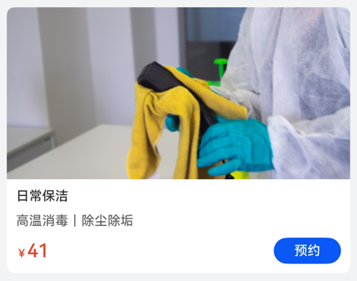

# 基础组件快速入门

## 目录

- [简介](#简介)
- [使用](#使用)
- [API参考](#API参考)

## 简介

本组件提供components目录下组件的基础能力集合。

| 类别     | 描述       | 使用指导          |
|:-------|:---------|:--------------|
| 公共方法   | 提供组件公共方法 | [使用指导](#公共方法) |
| 公共常量   | 提供组件公共常量 | [使用指导](#公共常量) |
| 公共模型   | 提供组件公共模型 | [使用指导](#公共模型) |
| 公共基础组件 | 提供公共基础组件 | [使用指导](#公共组件) |

## 使用

1. 安装组件。

   需要将模板根目录的components下[module_base](../module_base)目录拷贝至您工程根目录components/，并添加依赖和module声明。

```
// entry/oh-package.json5
"dependencies": {
  "module_base": "file:../components/module_base"
}

// build-profile.json5
"modules": [
  {
    "name": "module_base",
    "srcPath": "./components/module_base"
  }
]
```

2. 引入组件。

```
import { CommonUtils, RouterMap, TypeGood, PopViewUtils } from 'module_base';
```

## API参考

### 公共方法

#### CommonUtils

通用方法类

##### assign

assign(target: Object, ...source: Object[])

对象赋值

##### formatDate

formatDate(datetime?: number): string

时间戳转换年月日xxxx-xx-xx

##### formatDateTime

formatDateTime(datetime?: number): string

时间戳转换成年月日时分秒xxxx-xx-xx xx:xx:xx

##### padZero

padZero(input: number): string

不足两位，后面补零

##### handleCash

handleCash(cash: number): string

金钱取整策略

##### openNoticeDialog

openNoticeDialog(param: [ICommonDialogParams](#ICommonDialogParams类型说明))

打开通用提示弹窗

##### openConfirmDialog

openConfirmDialog(param: [ICommonDialogParams](#ICommonDialogParams类型说明))

打开通用确认弹窗

##### ICommonDialogParams类型说明

| 参数名        | 类型          | 必填 | 说明            |
|:-----------|:------------|:---|:--------------|
| content    | ResourceStr | 是  | 弹窗内容          |
| priBtnV    | ResourceStr | 否  | 第一个按钮，默认文本是取消 |
| secBtnV    | ResourceStr | 否  | 第二个按钮，默认文本是确认 |
| secBtnRole | ButtonRole  | 否  | 第二个按钮role     |
| confirm    | () => void  | 否  | 第二个按钮点击事件     |
| cancel     | () => void  | 否  | 第一个按钮点击事件     |

##### showLoading

handleCash(cash: number): string

金钱取整策略

##### showLoading

showLoading()

打开loading弹窗

##### hideLoading

hideLoading()

关闭loading弹窗

##### handleImgUrl

handleImgUrl(url: string): string

处理图片url，支持Image组件展示网络图片、mockImage://xxx.png、resourceImage://xxx


---

#### SystemSceneUtils

系统方法类

##### checkPermissionGrant

checkPermissionGrant(permission: Permissions): Promise<boolean>

检查用户是否授权

##### applyLocationPermission

applyLocationPermission(): Promise<boolean>

向用户申请位置权限

##### getCurrentCityInfo

getCurrentCityInfo(): Promise<string>

获取当前所在城市位置

##### requestPaymentPromise

requestPaymentPromise(ignoreRequestPayment: boolean, context: common.UIAbilityContext): Promise<void>

请求调用华为支付，ignoreRequestPayment传入true表示走mock场景、传入false表示真实调用支付api

---

#### PopViewUtils

基础弹窗类

**开发前提**：

```
import { AppStorageMap } from 'module_base';

onWindowStageCreate(windowStage: window.WindowStage): void {
 window.getLastWindow(this.context).then((data: window.Window) => {
   let uiContext = data.getUIContext();
   AppStorage.setOrCreate<UIContext>(AppStorageMap.UI_CONTEXT, uiContext);
 });
}
```

##### shareInstance

shareInstance(): PopViewUtils

创建实例

##### showPopView

showPopView<T extends object>(contentView: WrappedBuilder<[T]>, args: T, options?: promptAction.BaseDialogOptions)

**示例代码**

```
class PhoneParams {
  phones: string[] = [];

  constructor(phones: string[]) {
    this.phones = phones;
  }
}

@Builder
export function DialogCallBuilder(params: PhoneParams) {
  Column({ space: 10 }) {
    ForEach(params.phones, (phone: string) => {
      Text(phone)
    }, (v: string) => v)
    Text('取消')
  }
}

PopViewUtils.showPopView<PhoneParams>(wrapBuilder(DialogCallBuilder), new PhoneParams([]));
```

打开弹窗

##### closePopView

closePopView()

关闭弹窗


---

#### Logger

日志打印类

##### constructor

constructor(prefix: string = '[HouseholdTemplate]', domain: number = 0xFF00)

构造函数

##### debug

debug(...args: Object[])

打印debug级别日志

##### info

info(...args: Object[])

打印info级别日志

##### warn

warn(...args: Object[])

打印warn级别日志

##### error

error(...args: Object[])

打印error级别日志

### 公共常量

#### RouterMap枚举说明

| 名称             | 说明     |
|:---------------|:-------|
| ADDRESS_MANAGE | 地址管理页面 |
| EDIT_ADDRESS   | 编辑地址页面 |

#### IntroType枚举说明

| 名称    | 说明 |
|:------|:---|
| IMAGE | 图片 |
| TEXT  | 文本 |

#### TypeGood枚举说明

| 名称      | 说明   |
|:--------|:-----|
| PAY     | 付款类型 |
| CONSULT | 咨询类型 |

#### AppStorageMap枚举说明

| 名称         | 说明    |
|:-----------|:------|
| UI_CONTEXT | UI上下文 |

#### GoodCardSize枚举说明

| 名称     | 说明 |
|:-------|:---|
| NORMAL | 大卡 |
| SMALL  | 小卡 |

### 公共模型

#### IGoodInfo类型说明

| 参数名                | 类型                                          | 必填 | 说明                                                                           |
|:-------------------|:--------------------------------------------|:---|:-----------------------------------------------------------------------------|
| id                 | string                                      | 是  | 商品ID                                                                         |
| type               | [TypeGood](#TypeGood枚举说明)                   | 是  | 商品类型                                                                         |
| classId            | string                                      | 是  | 所属类目ID                                                                       |
| title              | string                                      | 是  | 商品名称                                                                         |
| subTitle           | string                                      | 是  | 副标题                                                                          |
| image              | string                                      | 是  | 主图，引用网络图片需要申请权限ohos.permission.INTERNET，引用本地media目录资源格式为：resourceImage://xxx |
| intro              | [IntroItem](#IntroItem类型说明)[]               | 是  | 详情富文本                                                                        |
| price              | number                                      | 是  | 价格                                                                           |
| vipPrice           | number                                      | 是  | 会员价                                                                          |
| soldNum            | number                                      | 是  | 已售出数量                                                                        |
| serviceContentList | [IContent](#IContent类型说明)[]                 | 是  | 服务内容                                                                         |
| serviceDetailList  | [IServiceDetail](#IServiceDetailItem类型说明)[] | 否  | 服务选项                                                                         |
| servicePipeList    | string[]                                    | 是  | 服务流程                                                                         |
| feeList            | string[]                                    | 是  | 费用说明                                                                         |
| qaList             | [IQuestionAnswer](#IQuestionAnswer类型说明)[]   | 是  | 常见问题                                                                         |

**备注**：GoodInfo是IGoodInfo的实现类。

#### IntroItem类型说明

| 参数名   | 类型                          | 必填 | 说明    |
|:------|:----------------------------|:---|:------|
| type  | [IntroType](#IntroType枚举说明) | 是  | 富文本类型 |
| value | string                      | 是  | 富文本值  |

#### IContent类型说明

| 参数名     | 类型     | 必填 | 说明 |
|:--------|:-------|:---|:---|
| title   | string | 是  | 标题 |
| content | string | 是  | 内容 |

#### IServiceDetailItem类型说明

| 参数名        | 类型     | 必填 | 说明     |
|:-----------|:-------|:---|:-------|
| desc       | string | 是  | 服务描述   |
| count      | number | 是  | 服务数量   |
| extraCount | number | 否  | 服务额外数量 |
| price      | number | 是  | 服务单价   |

#### IServiceDetail类型说明

| 参数名      | 类型                                              | 必填 | 说明   |
|:---------|:------------------------------------------------|:---|:-----|
| title    | string                                          | 是  | 标题   |
| subTitle | string                                          | 是  | 副标题  |
| prices   | [IServiceDetailItem](#IServiceDetailItem类型说明)[] | 是  | 价格列表 |

#### IQuestionAnswer类型说明

| 参数名      | 类型     | 必填 | 说明 |
|:---------|:-------|:---|:---|
| question | string | 是  | 问题 |
| answer   | string | 是  | 答案 |

#### IGoodCategory类型说明

| 参数名           | 类型                            | 必填 | 说明   |
|:--------------|:------------------------------|:---|:-----|
| categoryId    | string                        | 是  | 类别id |
| categoryLabel | string                        | 是  | 类别名称 |
| list          | [IGoodInfo](#IGoodInfo类型说明)[] | 是  | 类别列表 |

### 公共组件

#### 空白组件 UIEmpty(option: UIEmptyOptions)

**UIEmptyOptions对象说明**

| 参数名       | 类型          | 必填 | 说明   |
|:----------|:------------|:---|:-----|
| emptyDesc | ResourceStr | 否  | 文本   |
| fg        | number      | 否  | 字体大小 |

---

#### 常规确认弹窗 ConfirmDialogBuilder(option: CommonDialogParams)

**CommonDialogParams对象说明**

| 参数名        | 类型          | 必填 | 说明      |
|:-----------|:------------|:---|:--------|
| content    | ResourceStr | 否  | 弹窗正文内容  |
| priBtnV    | ResourceStr | 否  | 主按钮文本   |
| secBtnV    | ResourceStr | 否  | 副按钮文本   |
| secBtnRole | ButtonRole  | 否  | 副按钮类型   |
| confirm    | () => void  | 否  | 主按钮点击事件 |
| cancel     | () => void  | 否  | 副按钮点击事件 |

---

#### 商品卡片 GoodCard(option: GoodCardOptions)

**GoodCardOptions对象说明**

| 参数名         | 类型                                | 必填 | 说明                          |
|:------------|:----------------------------------|:---|:----------------------------|
| goodInfo    | [GoodInfo](#IGoodInfo类型说明)        | 否  | 商品信息                        |
| type        | [GoodCardSize](#GoodCardSize枚举说明) | 否  | 卡片类型，默认值GoodCardSize.NORMAL |
| onBtnClick  | () => void                        | 否  | 预约按钮点击事件                    |
| onCardClick | () => void                        | 否  | 卡片点击事件                      |

**示例代码**

```
import { GoodCard, GoodCardSize, IGoodInfo, TypeGood } from 'module_base'

@Entry
@ComponentV2
struct BaseSample {
  @Local good: IGoodInfo = {
    type: TypeGood.PAY,
    classId: '1',
    id: '1',
    title: '日常保洁',
    subTitle: '高温消毒｜除尘除垢',
    image: '',
    intro: [],
    price: 119,
    vipPrice: 41,
    soldNum: 800,
    serviceContentList: [],
    serviceDetailList: [],
    servicePipeList: [],
    feeList: [],
    qaList: [],
  };

  build() {
    NavDestination() {
      Column({ space: 10 }) {
        GoodCard({
          goodInfo: this.good,
          type: GoodCardSize.NORMAL,
          onBtnClick: () => {
            this.getUIContext().getPromptAction().showToast({ message: '按钮点击事件' });
          },
          onCardClick: () => {
            this.getUIContext().getPromptAction().showToast({ message: '卡片点击事件' });
          },
        })

        Row() {
          GoodCard({
            goodInfo: this.good,
            type: GoodCardSize.SMALL,
            onCardClick: () => {
              this.getUIContext().getPromptAction().showToast({ message: '卡片点击事件' });
            },
          }).width('48%')
          GoodCard({
            goodInfo: this.good,
            type: GoodCardSize.SMALL,
            onCardClick: () => {
              this.getUIContext().getPromptAction().showToast({ message: '卡片点击事件' });
            },
          }).width('48%')
        }.justifyContent(FlexAlign.SpaceBetween).width('100%')

      }
      .width('100%')
      .padding(10)
    }
    .title('基础组件')
    .backgroundColor('#F1F3F5')
  }
}
```

| 大卡                                              | 小卡                                                |
|-------------------------------------------------|---------------------------------------------------|
|  |  |
