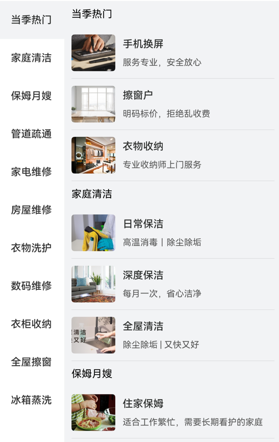

# 分类组件快速入门

## 目录

- [简介](#简介)
- [使用](#使用)
- [API参考](#API参考)
- [示例代码](#示例代码)

## 简介

本组件提供左右分类容器组件。



## 使用

1. 安装组件。
   由于分类组件依赖module_base组件，所以需要将模板根目录的components下[module_base](../module_base)
   和[module_category](../module_category)目录拷贝至您工程根目录components/，并添加依赖和module声明。

```
// entry/oh-package.json5
"dependencies": {
  "module_base": "file:../components/module_base",
  "module_category": "file:../components/module_category"
}

// build-profile.json5
"modules": [
  {
    "name": "module_base",
    "srcPath": "./components/module_base"
  },
  {
    "name": "module_category",
    "srcPath": "./components/module_category",
  }
]
```

2. 引入组件。

```
import { CategoryController, CategoryLayout } from 'module_category';
```

## API参考

### CategoryLayout(option: CategoryLayoutOptions)

#### CategoryLayoutOptions对象说明

| 参数名              | 类型                                                                  | 必填 | 说明       |
|:-----------------|:--------------------------------------------------------------------|:---|:---------|
| contentList      | [IGoodCategory](#IGoodCategory类型说明)                                 | 是  | 内容列表数据   |
| initIndex        | number                                                              | 否  | 滚轮初始索引位置 |
| controller       | [CategoryController](#CategoryController)                           | 否  | 分类控制器    |
| onScrollIndex    | (index: number) => void                                             | 否  | 滚动回调     |
| itemBuilderParam | (good: [IGoodInfo](../module_base/README.md#igoodinfo类型说明)) => void | 否  | 自定义每一项组件 |

#### IGoodCategory类型说明

| 参数名           | 类型                                                    | 必填 | 说明        |
|:--------------|:------------------------------------------------------|:---|:----------|
| categoryId    | string                                                | 是  | 分类id，唯一索引 |
| categoryLabel | string                                                | 是  | 分类文字描述    |
| list          | [IGoodInfo](../module_base/README.md#igoodinfo类型说明)[] | 是  | 分类所包含的条目  |

### CategoryController

分类组件的控制器，用于控制分类条目的滚动。同一个控制器不可以控制多个分类组件。

#### constructor

constructor()

CategoryController的构造函数。

#### scrollToIndex

scrollToIndex(index: number)

滚动到指定索引位置

## 示例代码

```
import { IGoodCategory, IGoodInfo, TypeGood } from 'module_base';
import { CategoryController, CategoryLayout } from 'module_category';

const GOOD_SAMPLE: IGoodInfo = {
  type: TypeGood.PAY,
  classId: '1',
  id: '1',
  title: '日常保洁',
  subTitle: '高温消毒｜除尘除垢',
  image: '',
  intro: [],
  price: 119,
  vipPrice: 41,
  soldNum: 800,
  serviceContentList: [],
  serviceDetailList: [],
  servicePipeList: [],
  feeList: [],
  qaList: [],
};

const generateGood = (title: string, index: number): IGoodInfo => {
  const temp: IGoodInfo = JSON.parse(JSON.stringify(GOOD_SAMPLE));
  temp.id += index;
  temp.title = title + index
  return temp;
};

const generateGoodList = () => {
  const CATEGORY_LIST: string[] = ['日常清洁', '冰箱清洗', '家电维修', '全屋玻璃', '家电维修', '衣物整理'];
  return CATEGORY_LIST.map((v: string, index: number): IGoodCategory => {
    return {
      categoryId: index.toString(),
      categoryLabel: v,
      list: [
        generateGood(v, 1),
        generateGood(v, 2),
      ],
    };
  });
};

@Entry
@ComponentV2
struct CategorySample {
  @Local list: IGoodCategory[] = generateGoodList();
  controller: CategoryController = new CategoryController();

  @Builder
  buildItem(good: IGoodInfo) {
    Column() {
      Row({ space: 10 }) {
        Image(good.image)
          .width(60)
          .height(50)
          .borderRadius(4)
          .alt($r('app.media.ic_placeholder_img'))
        Column({ space: 10 }) {
          Text(good.title).fontSize(14).fontWeight(500).fontColor(Color.Black)
          Text(good.subTitle).fontSize(12).fontColor(Color.Grey)
        }
        .alignItems(HorizontalAlign.Start)
      }
      .width('100%')
      .padding({ top: 10, bottom: 10 })
      .onClick(() => {
        this.getUIContext().getPromptAction().showToast({ message: `点击了${good.title}` });
      })

      Divider()
    }
  }

  build() {
    NavDestination() {
      Column() {
        CategoryLayout({
          contentList: this.list,
          initIndex: 0,
          controller: this.controller,
          itemBuilderParam: (good: IGoodInfo) => {
            this.buildItem(good)
          },
        })
      }
    }
    .title('分类组件')
  }
}
```
