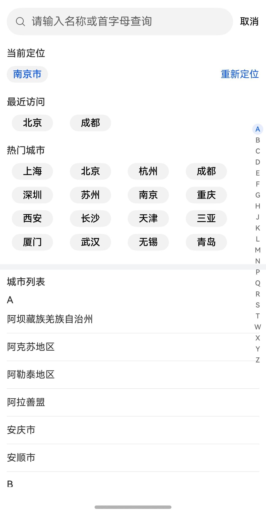

# 城市选择组件快速入门

## 目录

- [简介](#简介)
- [前提](#前提)
- [使用](#使用)
- [权限要求](#权限要求)
- [API参考](#API参考)
- [示例代码](#示例代码)

## 简介

本组件提供城市选择组件。



# 前提

定位当前城市需要开通地图服务，参考[开发准备](https://developer.huawei.com/consumer/cn/doc/harmonyos-guides/map-config-agc)

## 使用

1. 安装组件。

   需要将模板根目录的components下[module_city_select](../module_city_select)目录拷贝至您工程根目录components/，并添加依赖和module声明。

```
// entry/oh-package.json5
"dependencies": {
  "module_city_select": "file:../components/module_city_select"
}

// build-profile.json5
"modules": [
  {
    "name": "module_city_select",
    "srcPath": "./components/module_city_select"
  }
]
```

2. 引入组件。

```
import { CitySearchController, UICitySelect } from 'module_city_select'
```

3. 应用入口文件。

```
// EntryAbility.ets
onWindowStageCreate(windowStage: window.WindowStage): void {
 AppStorage.setOrCreate<Context>('Context', this.context);
}
```

## 权限要求

* 获取位置权限：ohos.permission.APPROXIMATELY_LOCATION

## API参考

### UICitySelect(option: UICitySelectOptions)

**UICitySelectOptions对象说明**

| 参数名                      | 类型                                            | 必填 | 说明          |
|:-------------------------|:----------------------------------------------|:---|:------------|
| currentCity              | string                                        | 否  | 当前定位城市      |
| recentVisitList          | string[]                                      | 否  | 最近访问的城市列表   |
| controller               | [CitySelectController](#CitySelectController) | 否  | 城市选择控制器     |
| goBack                   | (city?: string) => void                       | 否  | 返回上一级页面     |
| emitUpdateCityLocation   | (city: string) => void                        | 否  | 更新当前定位城市的回调 |
| emitUpdateRecentCityList | (city: string) => void                        | 否  | 更新最近访问城市的回调 |

### CitySelectController

分类组件的控制器，用于控制分类条目的滚动。同一个控制器不可以控制多个分类组件。

#### constructor

constructor()

CitySelectController的构造函数。

#### onBackPressed

onBackPressed(): boolean

触发组件内部返回事件

## 示例代码

```
import { CitySearchController, UICitySelect } from 'module_city_select';

@Entry
@ComponentV2
struct CitySelectSample {
  @Local currentCity: string = '武汉';
  controller: CitySearchController = new CitySearchController();

  onBackPress(): boolean | void {
    return this.controller.onBackPressed();
  }

  build() {
    NavDestination() {
      Column() {
        UICitySelect({
          currentCity: this.currentCity,
          recentVisitList: ['北京', '上海', '深圳', '广西'],
          controller: this.controller,
          emitUpdateCityLocation: (city: string) => {
            this.currentCity = city;
          },
          goBack: (citySelected?: string) => {
            const message = citySelected ? `选择了${citySelected}并返回` : '直接返回';
            this.getUIContext().getPromptAction().showToast({ message });
          },
        })
      }
      .width('100%')
    }
    .height('100%')
    .width('100%')
    .title('城市选择组件')
  }
}
```
