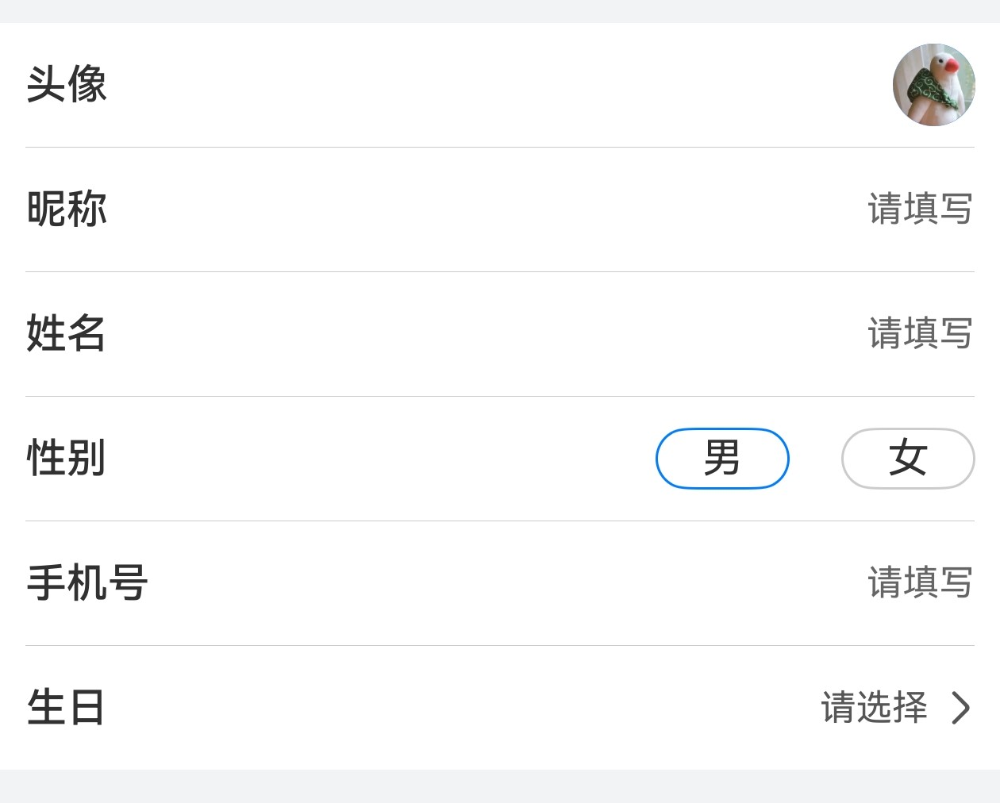

# 表单组件快速入门

## 目录

- [简介](#简介)
- [前提](#前提)
- [使用](#使用)
- [API参考](#API参考)
- [示例代码](#示例代码)

## 简介

本组件提供表单组件。



## 前提

使用FormType.AVATAR头像选择，参考[开发前提](https://developer.huawei.com/consumer/cn/doc/harmonyos-guides/account-get-avatar-nickname#section41863510349)

使用FormType.ADDRESS地点选择，参考[开发前提](https://developer.huawei.com/consumer/cn/doc/harmonyos-guides/map-config-agc)

## 使用

1. 安装组件。

   将模板根目录的components下[module_form](../module_form)目录拷贝至您的工程根目录components/，并添加依赖和module声明。

```
// entry/oh-package.json5
"dependencies": {
  "module_form": "file:../components/module_form"
}

// build-profile.json5
"modules": [
  {
    "name": "module_form",
    "srcPath": "./components/module_form",
  }
]
```

2. 引入组件。

```
import { FormItem, FormType } from 'module_form';
```

## API参考

### FormItem(option: FormItemOptions)

#### FormItemOptions对象说明

| 参数名         | 类型                          | 必填 | 说明          |
|:------------|:----------------------------|:---|:------------|
| param       | [IFormItem](#IFormItem类型说明) | 是  | 表单单元基本参数    |
| value       | ResourceStr                 | 否  | 文本值，支持双向绑定  |
| numberV     | number                      | 否  | 数字值， 支持双向绑定 |
| dateV       | Date\|null                  | 否  | 日期值，支持双向绑定  |
| formContent | () => void                  | 否  | 自定义内容区      |

#### IFormItem类型说明

| 参数名       | 类型                        | 必填 | 说明    |
|:----------|:--------------------------|:---|:------|
| type      | [FormType](#FormType枚举说明) | 是  | 表单类型  |
| label     | string                    | 是  | 标签文本  |
| required  | boolean                   | 否  | 是否必填项 |
| last      | boolean                   | 否  | 是否末尾项 |
| inputType | InputType                 | 否  | 输入框类型 |

#### FormType枚举说明

| 名称      | 说明    |
|:--------|:------|
| INPUT   | 基础输入框 |
| GENDER  | 性别选择  |
| DATE    | 日期选择  |
| AVATAR  | 头像头像  |
| ADDRESS | 地点选择  |
| TEXT    | 文本只读  |
| OTHER   | 其他    |

## 示例代码

```
import { FormItem, FormType } from 'module_form'

@Entry
@ComponentV2
struct FormSample {
  @Local avatarUrl: string = '';
  @Local name: string = '';
  @Local gender: number = 0;
  @Local phone: string = '';
  @Local birthDate: Date | null = null;
  @Local addr: string = '';

  build() {
    NavDestination() {
      Column() {
        Column() {
          FormItem({
            param: {
              type: FormType.AVATAR,
              label: '头像',
            },
            value: this.avatarUrl!!,
          })
          FormItem({
            param: {
              type: FormType.INPUT,
              label: '昵称',
            },
            value: this.name!!,
          })
          FormItem({
            param: {
              type: FormType.GENDER,
              label: '性别',
            },
            numberV: this.gender!!,
          })
          FormItem({
            param: {
              type: FormType.INPUT,
              inputType: InputType.PhoneNumber,
              label: '手机号',
            },
            value: this.phone!!,
          })
          FormItem({
            param: {
              type: FormType.DATE,
              label: '生日',
            },
            dateV: this.birthDate!!,
          })

          FormItem({
            param: {
              type: FormType.ADDRESS,
              label: '所在地区',
              last: true,
            },
            value: this.addr!!,
          })
        }
        .padding(10)
        .backgroundColor(Color.White)
        .borderRadius(4)
      }
      .width('100%')
      .height('100%')
    }
    .title('表单组件')
    .backgroundColor('#F1F3F5')
  }
}
```
