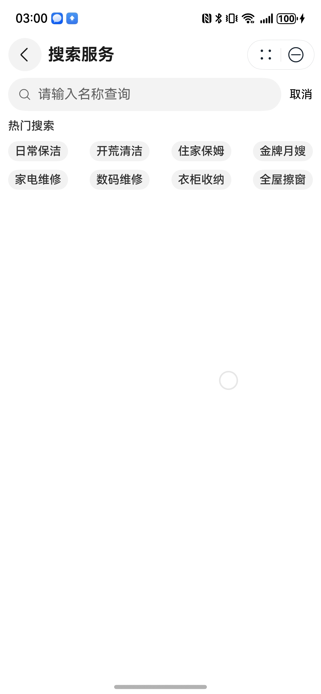

# 搜索组件快速入门

## 目录

- [简介](#简介)
- [使用](#使用)
- [API参考](#API参考)
- [示例代码](#示例代码)

## 简介

本组件提供搜索选择组件。

| 搜索前                                             | 搜索后                                             |
|-------------------------------------------------|-------------------------------------------------|
|  |  |

## 使用

1. 安装组件。

   由于搜索组件依赖module_base组件，所以需要将模板根目录的components下[module_base](../module_base)
   和[module_search](../module_search)
   目录拷贝至您工程根目录components/，并添加依赖和module声明。

```
// entry/oh-package.json5
"dependencies": {
  "module_base": "file:../components/module_base",
  "module_search": "file:../components/module_search"
}

// build-profile.json5
"modules": [
  {
    "name": "module_base",
    "srcPath": "./components/module_base"
  },
  {
    "name": "module_search",
    "srcPath": "./components/module_search",
  }
]
```

2. 引入组件。

```
import { UISearch, UISearchController } from 'module_search';
```

## API参考

### UISearch(option: UISearchOptions)

**UISearchOptions对象说明**

| 参数名           | 类型                                                                  | 必填 | 说明      |
|:--------------|:--------------------------------------------------------------------|:---|:--------|
| recommendList | string[]                                                            | 否  | 热门搜索    |
| list          | [IGoodInfo](../module_base/README.md#igoodinfo类型说明)[]               | 是  | 搜索结果列表  |
| controller    | [UISearchController](#UISearchController)                           | 是  | 搜索控制器   |
| query         | (content: string) => Promise<void>                                  | 是  | 触发查询    |
| goBack        | () => void                                                          | 是  | 返回上一级页面 |
| jumpDetail    | (good: [IGoodInfo](../module_base/README.md#igoodinfo类型说明)) => void | 是  | 跳转详情页   |

### UISearchController

搜索组件的控制器。

#### constructor

constructor()

UISearchController的构造函数。

#### onBackPressed

onBackPressed(): boolean

触发组件内部返回事件

## 示例代码

```
import { router } from '@kit.ArkUI';
import { IGoodInfo, TypeGood } from 'module_base';
import { UISearch, UISearchController } from 'module_search';

const LIST: IGoodInfo[] = [
  {
    type: TypeGood.PAY,
    classId: '1',
    id: '1',
    title: '日常保洁',
    subTitle: '高温消毒｜除尘除垢',
    image: 'resourceImage://ic_placeholder_img',
    intro: [],
    price: 119,
    vipPrice: 41,
    soldNum: 800,
    serviceContentList: [],
    serviceDetailList: [],
    servicePipeList: [],
    feeList: [],
    qaList: [],
  },
];

@Entry
@ComponentV2
struct SearchSample {
  @Local list: IGoodInfo[] = [];
  controller: UISearchController = new UISearchController();

  onBackPress(): boolean | void {
    return this.controller.onBackPressed();
  }

  build() {
    NavDestination() {
      Column() {
        UISearch({
          recommendList: ['日常保洁', '开荒清洁', '住家保姆', '金牌月嫂'],
          list: this.list,
          controller: this.controller,
          query: (content) => {
            return Promise.resolve().then(() => {
              this.list = LIST;
            });
          },
          jumpDetail: (v: IGoodInfo) => {
            this.getUIContext().getPromptAction().showToast({ message: '跳转详情页' });
          },
          goBack: () => {
            router.back();
          },
        })
      }
      .width('100%')
      .height('100%')
      .padding(10)
    }
    .title('搜索组件')
  }
}
```
