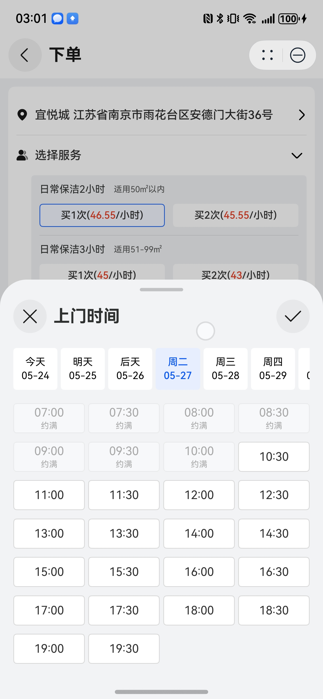

# 时间选择弹窗组件快速入门

## 目录

- [简介](#简介)
- [使用](#使用)
- [API参考](#API参考)
- [示例代码](#示例代码)

## 简介

本组件提供时间选择弹窗组件。



## 使用

1. 安装组件。

   需要将模板根目录的components下[module_time_select](../module_time_select)目录拷贝至您工程根目录components/，并添加依赖和module声明。

```
// entry/oh-package.json5
"dependencies": {
  "module_time_select": "file:../components/module_time_select"
}

// build-profile.json5
"modules": [
  {
    "name": "module_time_select",
    "srcPath": "./components/module_time_select",
  }
]
```

2. 引入组件。

```
import { TimeSelect } from 'module_time_select';
```

## API参考

### TimeSelect(option: TimeSelectOptions)

#### TimeSelectOptions对象说明

| 参数名          | 类型                                | 必填 | 说明           |
|:-------------|:----------------------------------|:---|:-------------|
| label        | ResourceStr                       | 否  | 时间文本         |
| timeOptions  | [TimeOptions](#TimeOptions类型说明)   | 否  | 天数、起止时间等时间选项 |
| styleOptions | [StyleOptions](#StyleOptions类型说明) | 否  | 样式选项         |
| onTimeSelect | (dateTime: Date) => void          | 否  | 选择时间的回调      |

#### TimeOptions类型说明

| 参数名       | 类型     | 必填 | 说明   |
|:----------|:-------|:---|:-----|
| days      | number | 否  | 天数   |
| startTime | string | 否  | 起始时间 |
| endTime   | string | 否  | 结束时间 |

#### StyleOptions类型说明

| 参数名                | 类型            | 必填 | 说明         |
|:-------------------|:--------------|:---|:-----------|
| dayFg              | ResourceColor | 否  | 未被选中日期文字颜色 |
| dayFgSelected      | ResourceColor | 否  | 被选中日期文字颜色  |
| timeBg             | ResourceColor | 否  | 未被选中时间文字颜色 |
| timeBgSelected     | ResourceColor | 否  | 被选中时间文字颜色  |
| timeBorder         | ResourceColor | 否  | 未被选中时间边框颜色 |
| timeBorderSelected | ResourceColor | 否  | 被选中时间边框颜色  |

## 示例代码

```
import { TimeSelect } from 'module_time_select'

@Entry
@ComponentV2
struct TimeSelectSample {
  @Local date: Date | null = null;

  @Computed
  get getTimeText() {
    if (this.date) {
      return this.date.toLocaleString();
    }
    return '请选择';
  }

  build() {
    NavDestination() {
      Column() {
        Row() {
          Text('上门时间')
            .fontSize(14)
            .fontWeight(500)
            .margin({ left: 8 })
          Blank()
          TimeSelect({
            label: this.getTimeText,
            timeOptions: {
              days: 7,
              startTime: '06:59:00',
              endTime: '19:30:00',
            },
            styleOptions: {
              dayFgSelected: '#0A59F7',
              timeBgSelected: '#F2F6FE',
              timeBorderSelected: '#2269F7',
            },
            onTimeSelect: (dateTime: Date) => {
              this.date = dateTime;
            },
          })
        }
        .width('100%')
        .height(48)
        .padding(10)
        .backgroundColor(Color.White)
        .borderRadius(4)
      }
      .padding(10)
    }
    .title('时间选择弹窗组件')
    .backgroundColor('#F1F3F5')
  }
}
```
