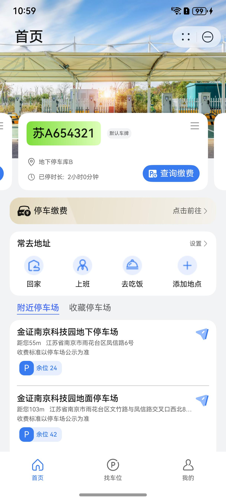
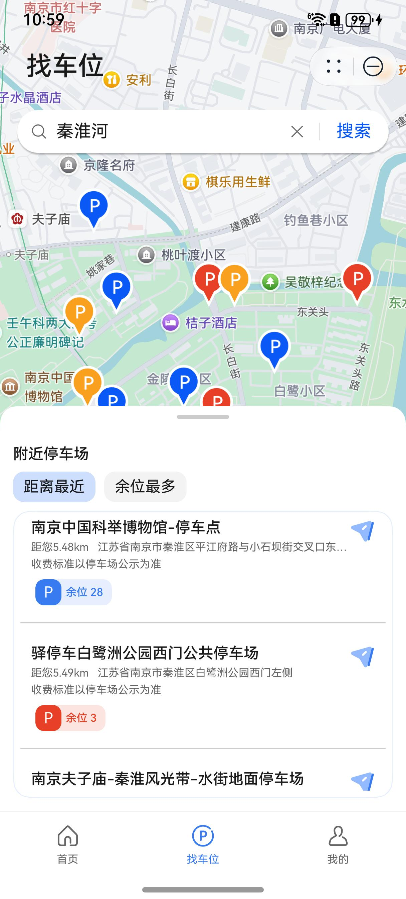
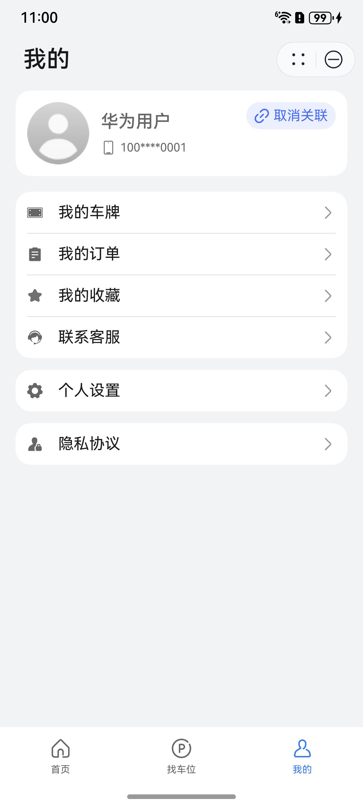

# 出行导航（停车）元服务模板快速入门

## 目录

- [功能介绍](#功能介绍)
- [环境要求](#环境要求)
- [快速入门](#快速入门)
- [示例效果](#示例效果)
- [权限要求](#权限要求)
- [开源许可协议](#开源许可协议)

## 功能介绍

本模板为停车缴费元服务提供了常用功能的开发样例，模板主要分首页、找车位和我的三大模块：

* 首页：主要提供车牌轮播、停车缴费、常去地址、附近和收藏停车场展示等功能。

* 找车位：主要提供停车场的地图标注和列表展示功能，支持联想搜索和地图查找。

* 我的：展示个人信息，车牌、订单和收藏的管理以及联系客服功能。

本模板已集成华为账号、地图、通话、支付等服务，只需做少量配置和定制即可快速实现华为账号登录、地图定位搜索、一键拨号、停车缴费等功能。

| 首页                                                           | 找车位                                                           | 我的                                                           |
|--------------------------------------------------------------|---------------------------------------------------------------|--------------------------------------------------------------|
|  |  |  |

本模板主要页面及核心功能如下所示：

```
停车缴费模板
 |-- 首页
 |    |-- 车牌轮播
 |    |      |-- 信息展示
 |    |      |-- 刷新删除
 |    |      |-- 查询缴费入口
 |    |      └-- 新增车牌入口
 |    |-- 停车缴费
 |    |      |-- 订单查询页面
 |    |      |       |-- 车牌输入
 |    |      |       |-- 绑定车牌
 |    |      |       └-- 最近车牌
 |    |      └-- 订单结果页面
 |    |              └-- 华为支付
 |    |-- 常去地址
 |    |      |-- 设置地址入口
 |    |      |       |-- 基础地址
 |    |      |       └-- 其他地址
 |    |      └-- 目标地址跳转
 |    └-- 车场展示
 |           |-- 附近停车场
 |           └-- 收藏停车场
 |
 |-- 找车位
 |    |-- 地址搜索
 |    |      |-- 自动联想
 |    |      └-- 历史搜索
 |    |-- 地图展示
 |    |      |-- 绘制标注
 |    |      |-- 点击凸显
 |    |      |-- 个人定位
 |    |      └-- 滑动更新
 |    └-- 列表展示
 |           |-- 排序切换
 |           └-- 详情入口
 |                   |-- 基本信息
 |                   |-- 车位信息
 |                   |-- 收费信息
 |                   └-- 收藏/导航/拨号
 |
 └-- 我的
      |-- 信息展示
      |      └-- 账号关联
      |-- 车牌管理
      |      |-- 查看
      |      |-- 新增
      |      |-- 删除
      |      └-- 设为默认
      |-- 订单管理
      |      |-- 删除订单
      |      └-- 列表展示
      |              └-- 查看订单详情
      |-- 收藏管理
      |      |-- 取消收藏
      |      └-- 列表展示
      |              └-- 跳转车场详情
      |-- 联系客服
      |      └-- 快捷拨号
      |-- 个人设置
      |      └-- 信息修改
      └-- 隐私协议
```

本模板工程代码结构如下所示：

```
ParkTemplate
  |- commons                                       // 公共层
  |   |- commonlib/src/main/ets                    // 公共工具模块(har)
  |   |    |- constants 
  |   |    |     CommonContants.ets                // 公共常量
  |   |    |     CommonEnum.ets                    // 公共枚举
  |   |    |- models 
  |   |    |     |- FullLoading                    // 全局弹窗
  |   |    |     └- Router                         // 路由工具
  |   |    |- types                                // 公共类型
  |   |    └- utils 
  |   |          |- AccountUtil                    // 账号管理工具
  |   |          |- AddressUtil                    // 常用地址管理工具
  |   |          |- CollectUtil                    // 收藏停车场管理工具
  |   |          |- CommonUtil                     // 通用函数方法
  |   |          |- FormatUtil                     // 格式化工具
  |   |          |- LicenseUtil                    // 车牌管理工具
  |   |          |- LocationUtil                   // 定位管理工具
  |   |          |- Logger                         // 日志打印工具
  |   |          |- WidgetUtil                     // 卡片管理工具
  |   |          └- WindowUtil                     // 窗口管理工具
  |   |  
  |   |- componentlib/src/main/ets                 // 公共组件模块(har)
  |   |    |- components 
  |   |    |     CommonButton.ets                  // 公共按钮组件         
  |   |    |     CommonCall.ets                    // 公共拨号组件          
  |   |    |     CommonHeader.ets                  // 公共标题组件         
  |   |    |     CommonKeyboard.ets                // 公共车牌输入组件
  |   |    |     CommonSpotItem.ets                // 公共车场卡片组件
  |   |    |     CommonTab.ets                     // 公共页签组件
  |   |    |- pages                                // 账号关联页面及方法
  |   |    └- constants                            // 组件样式常量
  |   |   
  |   └- network/src/main/ets                      // 公共网络模块(har)
  |        |- apis                                 // 网络接口  
  |        |- mocks                                // 数据mock   
  |        |- models                               // 网络库封装    
  |        |- types                                // 请求和响应类型    
  |        └- utils                                   
  |
  |- products                                      // 应用层  
  |   └- phone/src/main/ets                        // 主包(hap)      
  |        |- constants                            // 导航栏配置常量                     
  |        |- entryability                         // 主进程生命周期                                            
  |        |- pages                              
  |        |     MainEntry.ets                     // 主页面
  |        |- phoneformability                     // 卡片生命周期         
  |        |- types                                // 导航栏接口定义
  |        |- viewmodels                           // 主页面视图模型
  |        |- widget1x2                            // 卡片页面1x2
  |        └- widget2x2                            // 卡片页面2x2         
  |                                            
  |- features/service                              // 特性层
  |   |- address/src/main/ets                      // 常用地址模块(hsp)
  |   |    |- components                                   
  |   |    |     CommonAddressListItem.ets         // 常用地址列表项 
  |   |    |- pages                                
  |   |    |     CommonAddressPage.ets             // 常用地址设置页
  |   |    └- viewmodels                           // 常用地址视图模型  
  |   |     
  |   |- detail/src/main/ets                       // 停车场详情模块(hsp)
  |   |    |- pages                               
  |   |    |     SiteDetailPage.ets                // 停车场详情页
  |   |    |- utils                                
  |   |    |     PreView.ets                       // 停车场预览图弹窗
  |   |    └- viewmodels                           // 详情页视图模型
  |   |  
  |   |- license/src/main/ets                      // 车牌管理模块(hsp)
  |   |    |- components                              
  |   |    |     MyLicenseCard.ets                 // 车牌卡片 
  |   |    |- pages                               
  |   |    |     AddLicensePage.ets                // 新增车牌页
  |   |    |     MyLicensePage.ets                 // 我的车牌页
  |   |    └- viewmodels                           // 车牌页视图模型   
  |   | 
  |   |- others/src/main/ets                       // 其他服务模块(hsp)
  |   |    |- collect                              // 收藏停车场   
  |   |    |- order                                // 订单管理 
  |   |    |     |- components                      
  |   |    |     |    OrderCardItem.ets            // 订单卡片组件
  |   |    |     |- pages
  |   |    |     |    OrderDetailPage.ets          // 订单详情页
  |   |    |     |    OrderListPage.ets            // 订单列表页
  |   |    |     └- viewmodels                     // 订单视图模型
  |   |    └- privacypolicy                        // 隐私政策   
  |   |- pay/src/main/ets                          // 支付查询模块(hsp)
  |   |    |- pages                               
  |   |    |     PayPage.ets                       // 订单结果页
  |   |    |     QueryPage.ets                     // 订单查询页
  |   |    └- viewmodels                           // 搜索页视图模型
  |   | 
  |   └- search/src/main/ets                       // 地址搜索模块(hsp)
  |        |- pages                               
  |        |     SearchPage.ets                    // 地址搜索页
  |        |- utils                                // 搜索历史管理工具
  |        └- viewmodels                           // 搜索页视图模型
  |    
  └- features/tab    
      |- find/src/main/ets                        // 找车位Tab模块(hsp)
      |    |- components                                  
      |    |     BottomPart.ets                   // 找车位底部区
      |    |     TopPart.ets                      // 找车位顶部区 
      |    |- pages                                
      |    |     FindPage.ets                     // 找车位Tab页
      |    |- types                               // 列表高度枚举 
      |    └- viewmodels                          // 找车位视图模型
      | 
      |- home/src/main/ets                        // 首页Tab模块(hsp)
      |    |- components                                  
      |    |     CommonAddress.ets                // 常用地址项 
      |    |     LicenseCardItem.ets              // 车牌卡片项
      |    |     LicenseSwiper.ets                // 车牌轮播
      |    |     SpotsList.ets                    // 停车场列表
      |    |- constants                           // 气泡配置常量     
      |    |- pages                                
      |    |     HomePage.ets                     // 首页Tab页
      |    |- types                               // 气泡接口定义 
      |    └- viewmodels                          // 首页视图模型
      | 
      └- mine/src/main/ets                        // 我的Tab模块(hsp)
           |- components                                  
           |     AvatarButton.ets                 // 头像选择按钮
           |     HeaderPart.ets                   // 我的信息展示
           |     Settings.ets                     // 我的更多设置
           |- constants                           // 我的设置常量     
           |- pages                                
           |     MinePage.ets                     // 我的Tab页
           |     ProfileEditPage.ets              // 信息编辑页
           |- types                               // 设置接口定义 
           |- utils                               // 电话相关方法 
           └- viewmodels                          // 我的视图模型
```

## 环境要求

### 软件

* DevEco Studio版本：DevEco Studio 5.0.0 Release及以上
* HarmonyOS SDK版本：HarmonyOS 5.0.0 Release SDK及以上

### 硬件

* 设备类型：华为手机（直板机）
* HarmonyOS版本：HarmonyOS 5.0.0 Release及以上

## 快速入门

### 配置工程

在运行此模板前，需要完成以下配置：

1. 在DevEco Studio中打开此模板。

2. 在AppGallery Connect创建元服务，将包名配置到模板中。

   a. 参考[创建元服务](https://developer.huawei.com/consumer/cn/doc/app/agc-help-createharmonyapp-0000001945392297)
   为元服务创建APPID，并进行关联。

   b. 返回应用列表页面，查看元服务的包名。

   c. 将模板工程根目录下AppScope/app.json5文件中的bundleName替换为创建元服务的包名。

3. 配置华为账号服务。

   a. 将元服务的client
   ID配置到模板工程根目录下products/phone模块的module.json5文件，详细参考：[配置Client ID](https://developer.huawei.com/consumer/cn/doc/atomic-guides/account-atomic-client-id)。

   b.
   添加公钥指纹，详细参考：[配置应用证书指纹](https://developer.huawei.com/consumer/cn/doc/app/agc-help-signature-info-0000001628566748#section5181019153511)。

   c.
   账号关联获取用户真实手机号，需要申请phone权限，详细参考：[配置scope权限](https://developer.huawei.com/consumer/cn/doc/atomic-guides/account-guide-atomic-permissions)。

4. 配置支付服务。
   华为支付当前仅支持商户接入，在使用服务前，需要完成商户入网、开发服务等相关配置，本模板仅提供了端侧集成的示例。详细参考：[支付服务接入准备](https://developer.huawei.com/consumer/cn/doc/harmonyos-guides/payment-preparations)。

### 运行调试工程

1. 连接调试手机和PC。

2. 对元服务[手工签名](https://developer.huawei.com/consumer/cn/doc/harmonyos-guides/ide-signing)。

3. 配置多模块调试：由于本模板存在多个模块，运行时需确保所有模块安装至调试设备。

   a. 运行模块选择“phone”。

   b. 下拉框选择“Edit Configurations”，在“Run/Debug Configurations”界面，选择“Deploy Multi Hap”页签，勾选上模板中所有模块。

   c. 点击"Run"，运行模板工程。

## 示例效果

1. [查询缴费](./screenshots/video_query.mp4)

2. [常用地址](./screenshots/video_address.mp4)

3. [附近收藏](./screenshots/video_detail.mp4)

4. [寻找车位](./screenshots/video_find.mp4)

5. [更多管理](./screenshots/video_mine.mp4)

## 权限要求

* 网络权限：ohos.permission.INTERNET
* 位置权限：ohos.permission.LOCATION
* 模糊位置权限：ohos.permission.APPROXIMATELY_LOCATION

## 开源许可协议

该代码经过[Apache 2.0 授权许可](http://www.apache.org/licenses/LICENSE-2.0)。