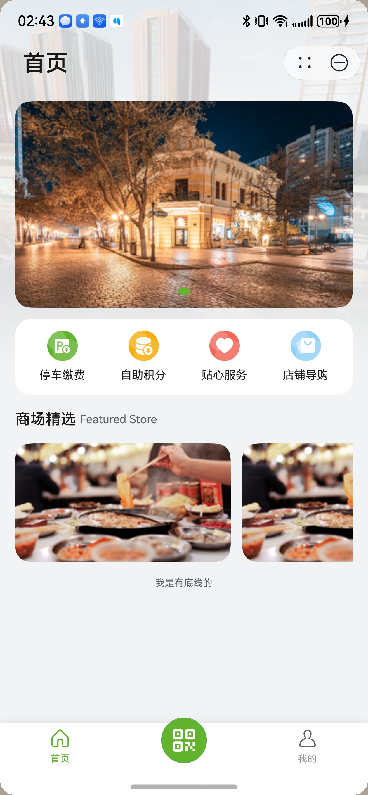
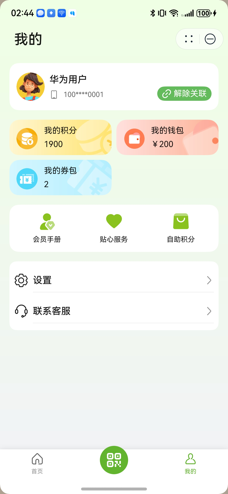
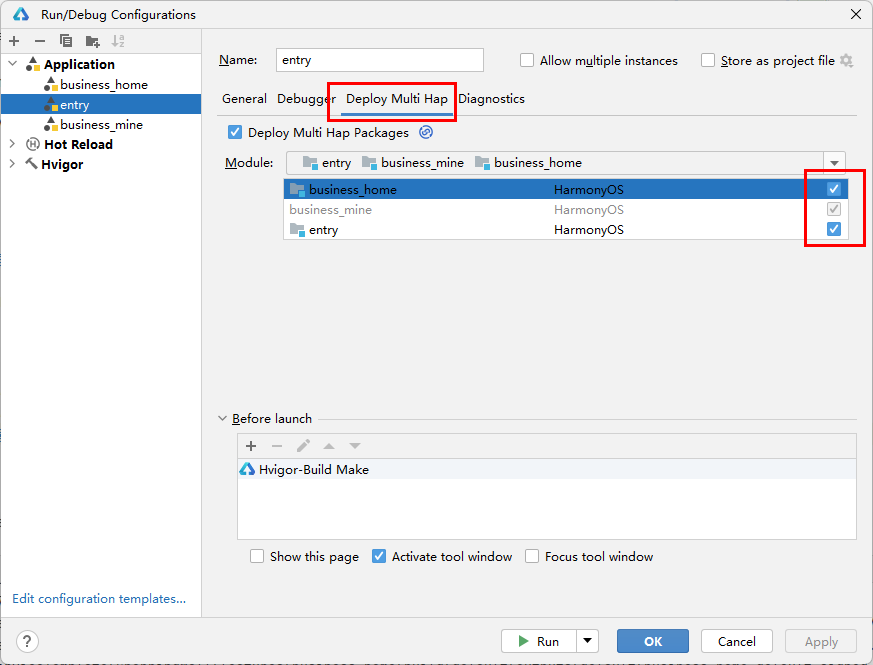

# 购物（购物中心）元服务模板快速入门

## 目录

- [功能介绍](#功能介绍)
- [环境要求](#环境要求)
- [快速入门](#快速入门)
- [示例效果](#示例效果)
- [权限要求](#权限要求)
- [开源许可协议](#开源许可协议)

## 功能介绍

您可以基于此[模板](#模板)直接定制元服务，也可以挑选此模板中提供的多种[组件](#组件)使用，从而降低您的开发难度，提高您的开发效率。

### 模板

本模板为商场类元服务提供了常用功能的开发样例，模板主要分首页、一码通和我的三大模块：

* 首页：提供停车缴费、自助积分、贴心服务、店铺导购等功能。

* 一码通：展示个人信息和会员码、提供签到功能。

* 我的：提供个人信息管理、我的积分管理、我的钱包管理、我的券包管理以及设置等功能。

本模板已集成华为账号、支付等服务，只需做少量配置和定制即可快速实现华为账号的登录、停车缴费等功能。

| 首页                                                    | 一码通                                                     | 我的                                                    |
|-------------------------------------------------------|---------------------------------------------------------|-------------------------------------------------------|
|  |  |  |

本模板主要页面及核心功能如下所示：

```text
商场模板
 |-- 首页
 |    |-- 停车缴费
 |    |     |-- 停车缴费
 |    |     |-- 管理车辆
 |    |     |-- 找车服务
 |    |     └-- 缴费记录
 |    |-- 自助积分
 |    |     |-- 扫码积分
 |    |     |-- 拍照积分
 |    |     |-- 自助积分记录
 |    |     └-- 积分指南
 |    |-- 贴心服务
 |    |-- 店铺导购
 |    └-- 商场精选
 |
 |-- 一码通
 |    |-- 个人信息
 |    |-- 签到
 |    └-- 二维码
 |
 └-- 我的
      |-- 用户信息
      |     |-- 个人信息
      |     └-- 编辑资料
      |-- 我的积分
      |     |-- 积分余额
      |     |-- 积分记录
      |     └-- 消费记录
      |-- 我的钱包
      |     |-- 钱包余额
      |     |-- 钱包充值
      |     |-- 充值记录           
      |     └-- 支出记录
      |-- 我的券包
      └-- 设置
```

本模板工程代码结构如下所示：

```text
ShoppingMall
├─commons                           
│  └─lib_common/src/main/ets
│       ├─components  
│       │   ├── AlertDialog.ets                          // 警告对话框 
│       │   ├── AsWebRichText.ets                        // 富文本编辑器 
│       │   ├── CallTelSheet.ets                         // 电话呼叫 
│       │   ├── EmptyComp.ets                            // 空白组件 
│       │   ├── LoadingDialog.ets                        // 加载组件 
│       │   ├── LoginComp.ets                            // 登录组件
│       │   ├── NavHeaderBar.ets                         // 页面导航栏头部组件                                     
│       │   ├── PageHeaderComp.ets                       // 页面标题组件 
│       │   └── SheetHeaderComp.ets                      // 半模态标题组件
│       │         
│       ├─constants         
│       │   ├── Common.ets                               // 通用常量 
│       │   └── RouterMap.ets                            // 路由表常量             
│       │                    
│       ├─httprequest    
│       │   ├── AxiosHttp.ets                            // axios二次封装                            
│       │   ├── AxiomRequest.ets                         // 创建请求实例          
│       │   ├── HttpRequest.ets                          // 业务接口封装                      
│       │   └── HttpRequestApi.ets                       // 业务接口定义 
│       │
│       ├─mock/MockData.ets                              // mock数据
│       │   
│       ├─models 
│       │   ├── ParamsModel.ets                          // 接口参数模型          
│       │   ├── RequestModel.ets                         // 接口请求模型
│       │   ├── ResponseModel.ets                        // 接口响应模型          
│       │   ├── RouterModel.ets                          // 路由跳转模型                             
│       │   ├── StorageModel.ets                         // 状态变量模型          
│       │   └── TabBarModel.ets                          // Tab模型                    
│       │         
│       ├─utils 
│       │   ├── EmitUtils.ets                            // 全局事件方法类
│       │   ├── FileUtils.ets                            // 文件处理方法类          
│       │   ├── FormatUtils.ets                          // 格式化方法类
│       │   ├── GlobalUtils.ets                          // 全局变量类          
│       │   ├── Logger.ets                               // 日志类
│       │   ├── LoginUtils.ets                           // 登录方法          
│       │   ├── RouterUtil.ets                           // 路由管理类      
│       │   └── Utils.ets                                // 通用方法     
│       │
│       └─viewmodels/BaseViewModel.ets                   // 基础viewmodel抽象类 
│
├─components
│  ├── module_coupon                                     // 优惠券组件                     
│  ├── module_keyboard                                   // 车牌键盘组件
│  └── module_points                                     // 自助积分组件            
│      
├─features
│  ├─business_home/src/main/ets                          // 首页模块             
│  │    ├─components
│  │    │   ├── AddPlateComp.ets                         // 添加车牌组件
│  │    │   └── GuideListComp.ets                        // 指南列表组件                  
│  │    ├─constants
│  │    │   └── Constants.ets                            // 常量定义             
│  │    ├─pages
│  │    │   ├── ConsiderateServicePage.ets               // 尊享服务页面
│  │    │   ├── FindCarPage.ets                          // 寻车页面
│  │    │   ├── FindCarResultPage.ets                    // 寻车结果页面
│  │    │   ├── ParkingPaymentPage.ets                   // 停车缴费入口页面
│  │    │   ├── PayDetailPage.ets                        // 支付详情页
│  │    │   ├── PayRecordPage.ets                        // 缴费记录页面
│  │    │   ├── PaySuccessPage.ets                       // 支付成功页面
│  │    │   ├── PlateNumberMgtPage.ets                   // 车牌管理页面
│  │    │   ├── PlateNumberPage.ets                      // 停车缴费页面
│  │    │   ├── ServiceDetailPage.ets                    // 贴心服务二级页面
│  │    │   ├── StoreGuideDetailPage.ets                 // 店铺详情页面
│  │    │   ├── StoreGuidePage.ets                       // 店铺导航页面
│  │    │   └── WebPage.ets                              // 网页页面                  
│  │    └─viewmodel
│  │        ├── PayDetailViewModel.ets                   // 支付详情视图模型
│  │        ├── PayRecordViewModel.ets                   // 缴费记录视图模型
│  │        ├── PaySuccessViewModel.ets                  // 支付成功视图模型
│  │        ├── ServiceDetailViewModel.ets               // 服务详细视图模型
│  │        ├── StoreGuideDetailViewModel.ets            // 店铺指南详细视图模型
│  │        └── StoreGuideViewModel.ets                  // 店铺指南视图模型      
│  │ 
│  └─business_mine/src/main/ets                         // 我的模块             
│       ├──components
│       │   ├── MenuComp.ets                            // 菜单组件
│       │   └── UserInfoComp.ets                        // 用户信息组件
│       ├──constants 
│       │   └── WalletConstants.ets                     // 钱包常量
│       ├──pages
│       │   ├── MembershipManualPage.ets                // 成员手册页面
│       │   ├── MembershipPage.ets                      // 成员页面
│       │   ├── MinePage.ets                            // 我的页面
│       │   ├── MyCouponsPage.ets                       // 我的优惠券页面
│       │   ├── MyWalletPage.ets                        // 我的钱包页面
│       │   ├── PrivacyPage.ets                         // 隐私政策页面
│       │   ├── RechargeWalletPage.ets                  // 充值钱包页面
│       │   ├── SettingPage.ets                         // 设置页面
│       │   └── UserInfoPage.ets                        // 用户信息页面
│       └──viewmodel               
│           ├── MinePageViewModel.ets                   // 我的页面视图模型
│           ├── MyWalletViewModel.ets                   // 我的钱包页面视图模型
│           ├── RechargeWalletViewModel.ets             // 充值钱包页面视图模型
│           ├── SettingPageViewModel.ets                // 设置页面视图模型
│           └── UserInfoViewModel.ets                   // 用户信息页面视图模型
│
└─products
   └─entry/src/main/ets                
        ├── common/Constants.ets                        // 常量定义
        ├── components/CustomTabBar.ets                 // 自定义标签栏组件      
        ├── entryability/EntryAbility.ets               // 主入口能力
        ├── entryformability/EntryFormAbility.ets       // 表单主入口能力
        ├── pages
        │   ├── HomePage.ets                            // 首页
        │   ├── Index.ets                               // 入口页面
        │   ├── IndexPage.ets                           // Tab页面        
        │   └── IntroducePage.ets                       // 商场介绍页面
        ├── utils/WidgetUtil.ets                        // 卡片工具类
        ├── viewModels/IndexViewModel.ets               // Tab页面ViewModel      
        └── widget/pages/WidgetCard.ets                 // 服务卡片          
 
```

### 组件

本模板中提供了多种组件，您可以按需选择合适的组件进行使用，所有组件存放在工程根目录的components下。

| 组件                      | 描述               | 使用指导                                         |
|:------------------------|:-----------------|:---------------------------------------------|
| 优惠券组件（module_coupon）    | 支持优惠券的管理和选择      | [使用指导](components/module_coupon/README.md)   |
| 车牌键盘组件（module_keyboard） | 支持国内通用车牌号的输入     | [使用指导](components/module_keyboard/README.md) |
| 自助积分组件（module_points）   | 支持扫码/拍照积分、管理积分记录 | [使用指导](components/module_points/README.md)   |

## 环境要求

### 软件

* DevEco Studio版本：DevEco Studio 5.0.0 Release及以上
* HarmonyOS SDK版本：HarmonyOS 5.0.0 Release SDK及以上

### 硬件

* 设备类型：华为手机（直板机）
* HarmonyOS版本：HarmonyOS 5.0.0 Release及以上

## 快速入门

### 配置工程

在运行此模板前，需要完成以下配置：

1. 在AppGallery Connect创建元服务，将包名配置到模板中。

   a. 参考[创建元服务](https://developer.huawei.com/consumer/cn/doc/app/agc-help-createharmonyapp-0000001945392297)
   为元服务创建APPID，并将APP ID与元服务进行关联。

   b. 返回应用列表页面，查看元服务的包名。

   c. 将模板工程根目录下AppScope/app.json5文件中的bundleName替换为创建元服务的包名。

2. 配置服务器域名。

   本模板接口均采用mock数据，由于元服务包体大小有限制，部分图片资源将从云端拉取，所以需为模板项目[配置服务器域名](https://developer.huawei.com/consumer/cn/doc/atomic-guides/agc-help-harmonyos-server-domain)
   ，“httpRequest合法域名”需要配置为：`https://agc-storage-drcn.platform.dbankcloud.cn`

3. 配置华为账号服务。

   a. 将元服务的client ID配置到products[phone]
   模块下src/main/module.json5文件，详细参考：[配置Client ID](https://developer.huawei.com/consumer/cn/doc/atomic-guides/account-atomic-client-id)。

   b.
   添加公钥指纹，详细参考：[配置应用证书指纹](https://developer.huawei.com/consumer/cn/doc/app/agc-help-signature-info-0000001628566748#section5181019153511)。

   c.
   如需获取用户真实手机号，需要申请phone权限，详细参考：[配置scope权限](https://developer.huawei.com/consumer/cn/doc/atomic-guides/account-guide-atomic-permissions)
   。在端侧使用快速验证手机号码Button进行[验证获取手机号码](https://developer.huawei.com/consumer/cn/doc/atomic-guides/account-guide-atomic-get-phonenumber)。

4. 配置支付服务。

   华为支付当前仅支持商户接入，在使用服务前，需要完成商户入网、开发服务等相关配置，本模板仅提供了端侧集成的示例。详细参考：[支付服务接入准备](https://developer.huawei.com/consumer/cn/doc/harmonyos-guides/payment-preparations)。

5. （可选）如果从应用自己服务器请求数据，需要配置服务器请求信息。

   a. 打开ShoppingMall/commons/lib_common/src/main/ets/constants/Common.ets文件，将BASE_URL修改为请求服务器的地址。

   b. 打开ShoppingMall/commons/lib_common/src/main/ets/httprequest/AxiosRequest.ets文件，将config.params配置为请求中的固定参数列表。

### 运行调试工程

1. 连接调试手机和PC。

2. 对元服务[手工签名](https://developer.huawei.com/consumer/cn/doc/harmonyos-guides/ide-signing#section297715173233)。

3. 真机调试

   a. 菜单选择“Run > Edit Configurations... ”，左侧导航选择“entry”，选择“Deploy Multi Hap”页签，勾选“Deploy Multi Hap
   Packages”，勾选上模板中所有模块。

   b. 点击"Run"，运行模板工程。

   

## 示例效果

1. [停车缴费](./screenshots/停车缴费.mp4)
2. [自助积分](./screenshots/自助积分.mp4)
3. [贴心服务&店铺导购](./screenshots/贴心服务&店铺导购.mp4)
4. [我的](./screenshots/我的.mp4)

## 权限要求

- 网络权限：ohos.permission.INTERNET

## 开源许可协议

该代码经过[Apache 2.0 授权许可](http://www.apache.org/licenses/LICENSE-2.0)。
