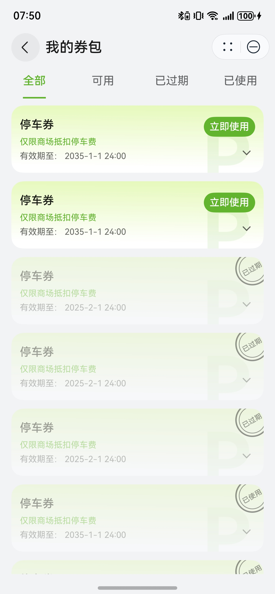

# 优惠券组件快速入门

## 目录

- [简介](#简介)
- [使用](#使用)
- [API参考](#API参考)
- [示例代码](#示例代码)

## 简介

本组件支持优惠券的管理和选择。

| 优惠券管理                                           | 优惠券选择                                           |
|-------------------------------------------------|-------------------------------------------------|
|  |  |

## 使用

1. 安装组件。

   需要将模板根目录的components下[module_coupon](../module_coupon)目录拷贝至您工程根目录components/，并添加依赖和module声明。

    ```
    // entry/oh-package.json5
    "dependencies": {
      "module_coupon": "file:../components/module_coupon"
    }

    // build-profile.json5
    "modules": [
      {
        "name": "module_coupon",
        "srcPath": "./components/module_coupon"
      }
    ]
    ```

2. 引入组件。

    ```
    import { MyCoupons, SelectCoupons, GlobalCouponUtils } from 'module_coupon';
    ```

## API参考

### MyCoupons(option: MyCouponsOptions)

**MyCouponsOptions对象说明**

| 参数名         | 类型         | 必填 | 说明        |
|:------------|:-----------|:---|:----------|
| clickUseNow | () => void | 否  | 点击立即使用的回调 |

### SelectCoupons(option: SelectCouponsOptions)

**SelectCouponsOptions对象说明**

| 参数名           | 类型                                  | 必填 | 说明       |
|:--------------|:------------------------------------|:---|:---------|
| selectIdParam | string                              | 否  | 传入的优惠券id |
| onSelect      | (id: string, money: number) => void | 否  | 选择优惠券的回调 |

### GlobalCouponUtils

优惠券对外方法

#### constructor

constructor()

GlobalCouponUtils的构造函数。

#### consumeCoupon

consumeCoupon(couponID: string): void

消费优惠券

## 示例代码

### 示例1（管理优惠券）

```ts
import { MyCoupons } from 'module_coupon';

@Entry
@ComponentV2
struct Sample1 {
  build() {
    NavDestination() {
      Column() {
        MyCoupons({
          clickUseNow: () => {
            this.getUIContext().getPromptAction().showToast({ message: '点击了立即使用' });
          },
        })
      }
      .width('100%')
    }
    .height('100%')
    .width('100%')
    .title('我的券包')
  }
}
```

### 示例2（选择优惠券）

```ts
import { SelectCoupons } from 'module_coupon';

@Entry
@ComponentV2
struct Sample2 {
  @Local selectedCouponID: string = '';
  @Local selectedCouponMoney: number = 0;
  @Local showCouponSheet: boolean = false;

  @Builder
  selectCouponBuilder() {
    Column() {
      SelectCoupons({
        selectIdParam: this.selectedCouponID,
        onSelect: (id: string, money: number) => {
          this.selectedCouponID = id;
          this.selectedCouponMoney = money;
          this.showCouponSheet = false;
        },
      })
    }
    .padding(10)
  }

  build() {
    NavDestination() {
      Column({ space: 20 }) {
        Text(`选择的优惠券ID：  ${this.selectedCouponID}`)
        Text(`选择的优惠券面额： ${this.selectedCouponMoney}`)
        Button('选择')
          .width('100%')
          .onClick(() => {
            this.showCouponSheet = true;
          })
          .bindSheet($$this.showCouponSheet, this.selectCouponBuilder(), {
            height: SheetSize.MEDIUM,
            title: {
              title: '选择优惠券',
            },
          })
      }
      .padding(12)
      .width('100%')
      .alignItems(HorizontalAlign.Start)
    }
    .height('100%')
    .width('100%')
    .title('选择优惠券')
  }
}
```
