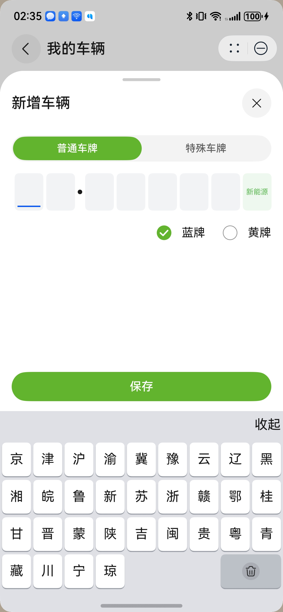
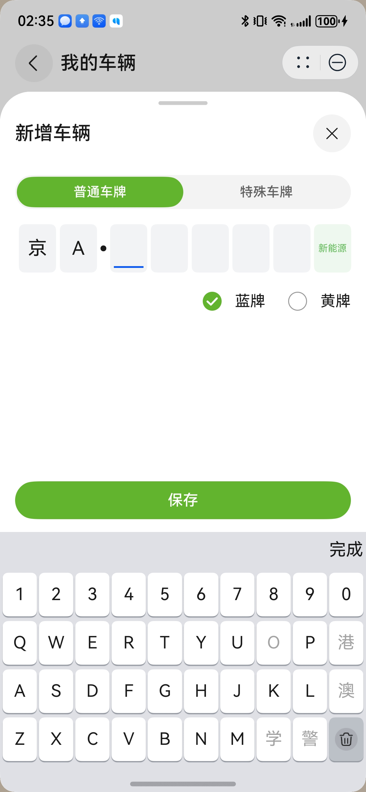

# 车牌键盘组件快速入门

## 目录

- [简介](#简介)
- [使用](#使用)
- [API参考](#API参考)
- [示例代码](#示例代码)

## 简介

本组件支持国内通用车牌号的输入。

| 输入省份                                             | 输入字母数字+特殊字                                       |
|--------------------------------------------------|--------------------------------------------------|
|  |  |

## 使用

1. 安装组件。

   需要将模板根目录的components下[module_keyboard](../module_keyboard)目录拷贝至您工程根目录components/，并添加依赖和module声明。

    ```
    // entry/oh-package.json5
    "dependencies": {
      "module_keyboard": "file:../components/module_keyboard"
    }

    // build-profile.json5
    "modules": [
      {
        "name": "module_keyboard",
        "srcPath": "./components/module_keyboard"
      }
    ]
    ```

2. 引入组件。

    ```
    import { UILicensePlate } from 'module_keyboard';
    ```

## API参考

### UILicensePlate(options: UILicensePlateOptions)

**UILicensePlate对象说明**

| 参数            | 类型                                                                                                                                          | 是否必填 | 说明                                                   |
|:--------------|:--------------------------------------------------------------------------------------------------------------------------------------------|:-----|:-----------------------------------------------------|
| intFocus      | boolean                                                                                                                                     | 否    | 默认值为false，初始化是否为输入框聚焦状态                              |
| plateNumber   | string                                                                                                                                      | 否    | 默认值为''，传入的车牌号，当该车牌号格式不合法时，不回显该车牌号。                   |
| controller    | [TextInputController](https://developer.huawei.com/consumer/cn/doc/harmonyos-references/ts-basic-components-textinput#textinputcontroller8) | 否    | 设置TextInput控制器，可控制键盘收起。                              |
| onChange      | (carNumber:string[], isComplete:boolean) => void                                                                                            | 否    | 输入车牌号发生变化时触发，carNumber为输入车牌号，isComplete标志当前车牌号是否输入完成 |
| onFormatError | (plateNumber: string) => void                                                                                                               | 否    | 传入的车牌号格式不正确时触发，plateNumber为格式不正确的车牌号                 |

## 示例代码

```ts
import { UILicensePlate } from 'module_keyboard';

@Entry
@ComponentV2
struct Sample1 {
  @Local plateNumber: string = '';

  build() {
    NavDestination() {
      Column() {
        UILicensePlate({
          //  传入的车牌号
          plateNumber: this.plateNumber,
          //  是否默认激活键盘，选中输入框
          intFocus: false,
          //  输入完整车牌后触发回调，获取车牌号
          onChange: (carNumber: string[], isComplete: boolean) => {
            console.log('当前输入车牌号', carNumber, '是否为完整车牌号', isComplete);
          },
          //  传入车牌号格式错误时触发
          onFormatError: (plateNumber: string) => {
            console.log('格式错误的车牌号', plateNumber);
          },
        })
      }
      .padding(10)
      .width('100%')
    }
    .height('100%')
    .width('100%')
    .title('车牌输入')
  }
}
```
