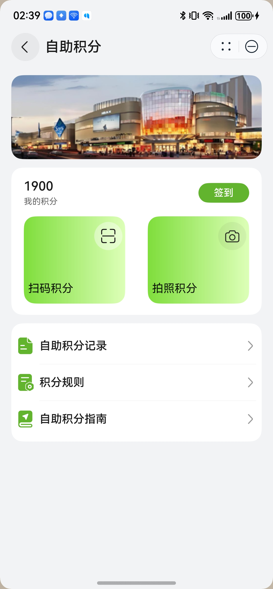
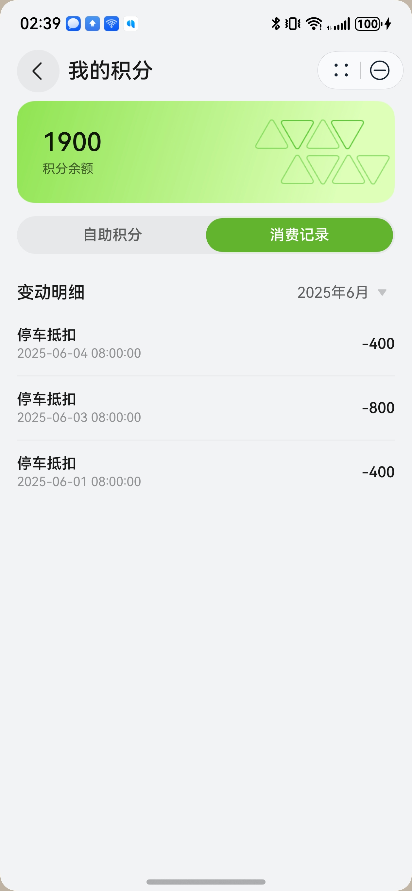

# 自助积分组件快速入门

## 目录

- [简介](#简介)
- [前提](#前提)
- [使用](#使用)
- [API参考](#API参考)
- [示例代码](#示例代码)

## 简介

本组件支持扫码/拍照积分、管理积分记录。

| 自助积分                                            | 我的积分--自助积分                                      | 我的积分--消费记录                                      |
|-------------------------------------------------|-------------------------------------------------|-------------------------------------------------|
|  |  |  |

## 前提

由于自助积分页面适配的是窗口全屏模式，需要在应用入口文件设置窗口全屏

```ts
// xxx/entryability/EntryAbility.ets
onWindowStageCreate(windowStage: window.WindowStage): void {
  // 获取应用主窗口
  let windowClass: window.Window = windowStage.getMainWindowSync(); 
  // 设置窗口全屏
  windowClass.setWindowLayoutFullScreen(true);
}
```

## 使用

1. 安装组件。

   需要将模板根目录的components下[module_points](../module_points)目录拷贝至您工程根目录components/，并添加依赖和module声明。

    ```
    // entry/oh-package.json5
    "dependencies": {
      "module_points": "file:../components/module_points"
    }

    // build-profile.json5
    "modules": [
      {
        "name": "module_points",
        "srcPath": "./components/module_points"
      }
    ]
    ```

2. 引入组件。

    ```
    import { RouterMap } from 'module_points';
    ```

## API参考

### GlobalPointUtils

自助积分对外方法。

#### constructor

constructor()

GlobalPointUtils的构造函数。

#### consumePoint

consumePoint(point: number): void

消费积分。

#### checkIn

checkIn(): void

签到。

### RouterMap

**枚举说明**

| 名称                      | 说明     |
|:------------------------|:-------|
| SELF_SERVICE_POINT_PAGE | 自助积分页面 |
| SELF_POINT_RECORD_PAGE  | 积分记录页面 |
| SELF_POINT_RULE         | 积分规则页面 |
| SELF_POINT_GUIDE        | 积分指南页面 |

## 示例代码

```
import { RouterMap } from 'module_points';

@Entry
@ComponentV2
struct Sample1 {
  stack: NavPathStack = new NavPathStack()

  build() {
    Navigation(this.stack) {
      Column({ space: 10 }) {
        Text('自助积分').fontSize(20).fontWeight(FontWeight.Bold)
        Button('跳转').width('100%').onClick(() => {
          this.stack.pushPath({
            name: RouterMap.SELF_SERVICE_POINT_PAGE,
          })
        })
      }
      .padding({
        left: 10,
        right: 10,
        top: 40,
      })
    }
    .hideTitleBar(true)
  }
}
```
